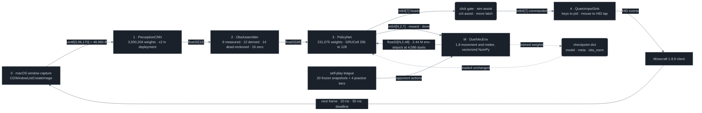
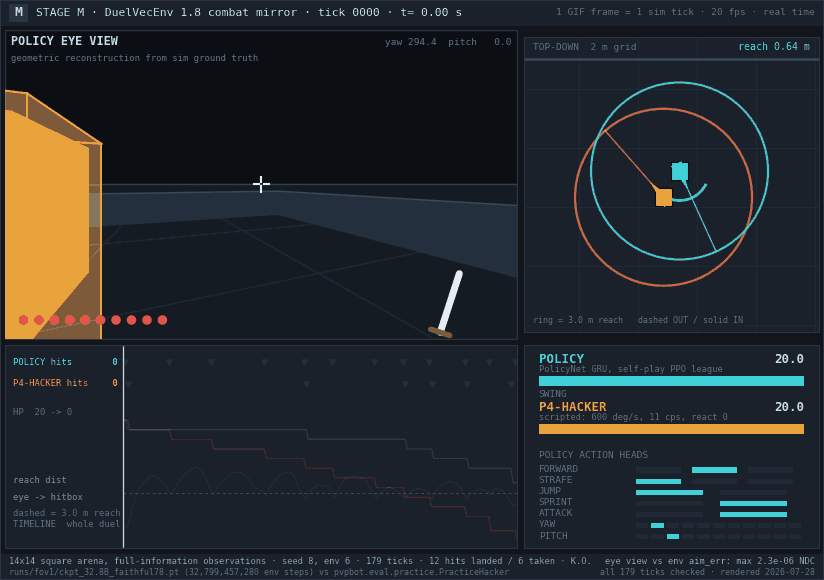
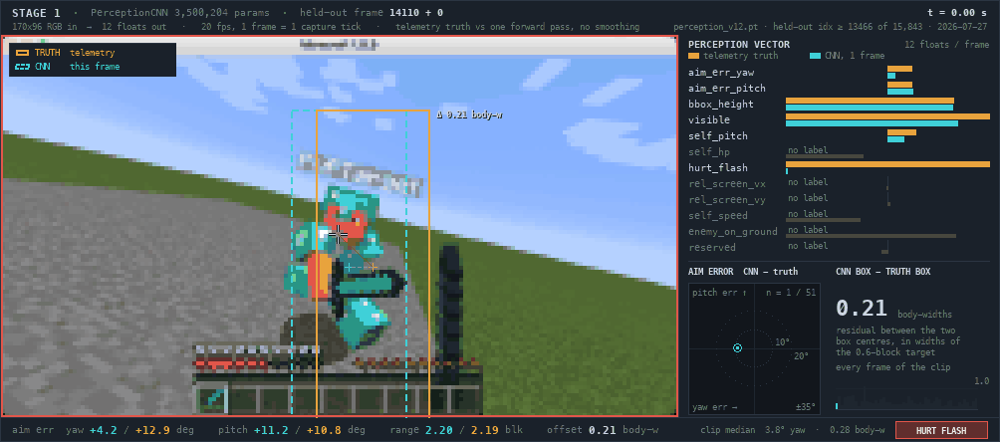
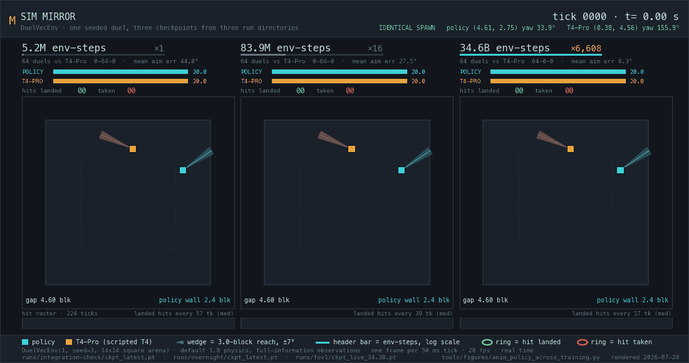
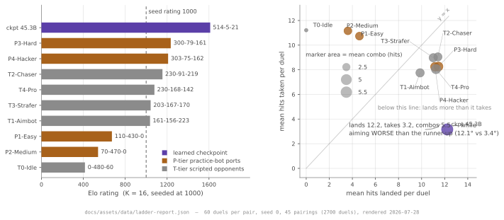

# mc-pvp-bot

**A Minecraft 1.8 sword-PvP bot that reads the screen, thinks for 0.5 ms, and moves a real mouse — twenty times a second, built on one laptop.**


<sub><b>The trained policy fighting P4-Hacker, rendered from inside its own camera.</b> A pinhole projection using the policy's own yaw and pitch every tick, 70° vertical field of view — 12 hits landed (one crit, −2.4) take the opponent from 20.0 HP to 0.0 over 179 ticks, and the policy finishes on 9.6 of 20. — <i>the 14×14 walled square arena (<code>arena_square=True</code>), full-information observations, <code>ckpt_32.8B_faithful78</code> at 32,799,457,280 env-steps vs <code>pvpbot.eval.practice.PracticeHacker</code></i> — <code>tools/figures/anim_policy_eye_view.py</code> · <i>180 frames @ 20 fps, one frame per 50 ms game tick, real time, the K.O. held 0.85 s</i></sub>

A *tick* is Minecraft's simulation step: 1/20 s, 50 ms — every decision in this repo is one tick's worth. There is no mod, no game API and no memory reading in the perception-to-action path: pixels go in through a screen capture, and synthetic keyboard and mouse events come out through the macOS HID layer — the harness's one out-of-band signal is a death flag file used as a respawn cue ([05 · Live harness](docs/05-harness.md)). The whole stack — a vectorized 1.8 physics engine, a self-play PPO league, a CNN that reads the screen, and a live loop that plays the real game — was built and trained on a single Apple M4 Max.

## The machine at a glance

| Part | What it is | Number | Source |
|---|---|---:|---|
| Observation bus | 48 × float32, 20 named slots tiling `[0,48)` exactly once | 16 slots (32–47) structurally zero | [`pvpbot/spec.py:38`](pvpbot/spec.py#L38) |
| Action bus | 7 categorical heads, 3·3·2·2·2·11·11 | 8,712 joint actions as 34 logits | [`pvpbot/spec.py:17`](pvpbot/spec.py#L17) |
| Controller | `PolicyNet` — MLP 48→256→256, `GRUCell(256,128)`, 7 heads + value | 231,075 parameters | [`pvpbot/models.py:14`](pvpbot/models.py#L14) |
| Sensor | `PerceptionCNN` — 4 conv layers → `Linear(8640,384)` → `Linear(384,12)`; the deployed path runs two of these ([03](docs/03-sensor.md)) | 3,500,204 parameters | [`pvpbot/models.py:57`](pvpbot/models.py#L57) |
| Sensor input | one uint8 RGB tensor, `uint8[3,96,170]` — a 170 × 96 px image | 48,960 bytes per frame | [`pvpbot/spec.py:10`](pvpbot/spec.py#L10) |
| Physics engine | `DuelVecEnv`, 1.8-accurate, vectorized NumPy | 2.44 M env-steps/s at 4,096 parallel duels | `python3 -m pvpbot.sim.bench --envs 4096 --steps 300` |
| Training | self-play PPO league, 4,194,304 env-steps per update | 99,300,147,200 env-steps over 23,675 updates | `runs/fov1/metrics.csv`, max `step` |
| Live budget | one tick at 20 Hz | 50 ms | [`pvpbot/deploy/loop.py:60`](pvpbot/deploy/loop.py#L60) |

The camera is quantized the same way at both ends: `CAMERA_BINS = (−30, −15, −7, −3, −1, 0, 1, 3, 7, 15, 30)` degrees per tick ([`pvpbot/spec.py:30`](pvpbot/spec.py#L30)). The extreme bin is 30 °/tick × 20 ticks/s = 600 °/s, which is exactly the rotation cap of the hardest scripted opponent in the repo ([`pvpbot/eval/practice.py:228`](pvpbot/eval/practice.py#L228)) — the learner can match it and cannot out-turn it.

## One pipe, two sources



The whole system is one pipe. 48,960 bytes of screen become twelve floats, become forty-eight floats, become seven integers, become mouse deltas and keystrokes, twenty times a second. In the middle sits a single 48-float vector ([`pvpbot/spec.py:38`](pvpbot/spec.py#L38)), the only interface any subsystem agrees on, and it has two possible sources: a CNN reading a real Minecraft window, or a NumPy reimplementation of 1.8's movement and melee tick. The policy cannot tell them apart, which is why weights trained on nothing but simulated env-steps drop into a screen-capture loop without a single change.

| Source of the `float32[48]` | Rate | Compute per tick | Source |
|---|---:|---:|---|
| camera → CNN → adapter | 20 Hz, pinned to the game clock | 23.045 ms | median over 3,375 settled ticks, `docs/assets/data/live-pixels-tick.json` |
| `DuelVecEnv` at 4,096 parallel duels | 2.44 M env-steps/s | 0.41 µs | `python3 -m pvpbot.sim.bench --envs 4096 --steps 300` |

The live path produces one 48-float vector every 23.045 ms of compute, median. The simulator steps 2.44 million duels per second, each one emitting the byte-identical type. The same compute budget that buys one live tick buys roughly **56,000 simulated ones**, and that ratio is the entire reason a NumPy engine was worth writing rather than driving a real client.

## One tick, all the way through

<details>
<summary>one real live tick traced through all five stages, with its value at each one</summary>

| # | Stage | Representation | Value on tick 326 (t = 18.145976 s) | Source |
|---:|---|---|---|---|
| 0 | screen capture | `uint8[3,96,170]` = 48,960 B | one captured frame; `capture 19.737 ms` | [`pvpbot/deploy/capture.py:256`](pvpbot/deploy/capture.py#L256) |
| 1 | `PerceptionCNN` (3,500,204 params) | `float32[12]` | `aim_err_pitch −0.06127` = **−5.51 deg**, down-positive as the renderer draws it; `encode 1.842 ms` | [`pvpbot/models.py:57`](pvpbot/models.py#L57) |
| 2 | `ObsAssembler` | `float32[48]` | `aim_err_pitch +0.06127` — the one sign flip in the whole trace, into the simulator's up-positive contract; `dist 0.36178` = **2.89 blocks** | [`pvpbot/perception/adapter.py:187`](pvpbot/perception/adapter.py#L187) |
| 3 | `PolicyNet` (231,075 params, GRU) | 7 categorical heads | the sampled heads are not recorded; the log holds the commanded action; `policy 0.479 ms` | [`pvpbot/models.py:14`](pvpbot/models.py#L14) |
| 4 | assists, latch, `QuartzInputSink` | `int64[7]` → HID events | `[0, 1, 0, 0, 1, 9, 7]` = back · no strafe · no jump · no sprint · **ATTACK** · yaw bin 9 (+15 deg/tick) · pitch bin 7 (+3 deg/tick); `inject 0.106 ms` | [`pvpbot/deploy/input_inject.py:275`](pvpbot/deploy/input_inject.py#L275) |
| — | **total** | — | **22.164 ms of a 50 ms budget** | [`pvpbot/deploy/loop.py:60`](pvpbot/deploy/loop.py#L60) |

<sub>Every value above is a literal field of one JSON line of the deployed loop's own flight recorder (paired live session, 4,000 logged rows, 3,375 with <code>settled=1</code>). The degree and block figures are the <code>OBS_LAYOUT</code> divisors applied to those literals — angles /180 for yaw and /90 for pitch, distances /8, HP /20 (<a href="pvpbot/spec.py#L34"><code>pvpbot/spec.py:34</code></a>) — plus <code>synth.dist_from_bbox_height</code> for the range.</sub>

The verbatim recorder line, all 48 slots decoded into physical units, and the assist law that picks the two camera bins: [01 · Interfaces](docs/01-interfaces.md).

</details>

## The controller, powered on



<sub><b>The trained policy taking P4-Hacker to a K.O. in 179 ticks.</b> Four panels off the same 50 ms tick — the eye view, the top-down geometry whose 3.0-block reach rings snap from dashed to solid the instant the opponent's hitbox is inside reach, all seven action heads as they are sampled, and both HP tracks; 12 hits landed (one a 2.4 jump crit), 6 taken, 9.6 HP left. — <i>the 14×14 walled square arena (<code>arena_square=True</code>), full-information observations, seed 8 env 6</i> — <code>runs/fov1/ckpt_32.8B_faithful78.pt</code> · <i>180 frames @ 20 fps, the K.O. held 0.85 s</i></sub>

*Reach* is the distance from the attacker's eye to the nearest point of the target's 0.6 × 1.8 block box: one block is one metre, and a swing connects at ≤ 3.0 blocks ([`pvpbot/sim/env.py:81`](pvpbot/sim/env.py#L81)). A *crit* is a swing thrown while airborne and falling, worth 1.5× damage. **P4-Hacker** is the top row of the PracticeBotPvP difficulty table, ported and then calibrated against the real thing ([`pvpbot/eval/practice.py:212`](pvpbot/eval/practice.py#L212)):

| P4-Hacker setting | Value | Source |
|---|---:|---|
| rotation cap | 600 deg/s | [`pvpbot/eval/practice.py:228`](pvpbot/eval/practice.py#L228) |
| reaction | 0 ticks | [`pvpbot/eval/practice.py:229`](pvpbot/eval/practice.py#L229) |
| click rate | 11.0 CPS | [`pvpbot/eval/practice.py:230`](pvpbot/eval/practice.py#L230) |
| crit / w-tap / strafe rates | 1.0 / 1.0 / 1.0 | [`pvpbot/eval/practice.py:231`](pvpbot/eval/practice.py#L231) |
| aim jitter | 1.5 deg | [`pvpbot/eval/practice.py:232`](pvpbot/eval/practice.py#L232) |
| swings timed to the victim's hurt window | True | [`pvpbot/eval/practice.py:233`](pvpbot/eval/practice.py#L233) |
| engage band | 2.0–2.8 blocks | [`pvpbot/eval/practice.py:234`](pvpbot/eval/practice.py#L234) |

<sub><i>CPS</i> is clicks per second; the competitive human band is 8–14 (<code>MILESTONES.md</code>). The eye-view projection in the left panel of the clip above was cross-checked against the environment's own <code>aim_err_yaw</code> / <code>aim_err_pitch</code> observation channels on all 178 rendered ticks, maximum residual 4.47 × 10⁻⁶ in normalised device coordinates (<code>docs/assets/data/duel-vs-p4hacker.json</code>).</sub>

<details><summary>the exact command, and its output</summary>

```sh
python3 - <<'EOF'
import torch
from pvpbot.eval.arena import run_match
from pvpbot.eval.scripted import default_tiers
from pvpbot.eval.practice import practice_tiers
ck = "runs/fov1/ckpt_32.8B_faithful78.pt"
mobile = [t for t in default_tiers(5) if t.name in ("T2-Chaser", "T3-Strafer", "T4-Pro")]
for o in mobile + practice_tiers(5):
    torch.manual_seed(5)                       # PolicyNet.act samples off the global RNG
    r = run_match(ck, o, num_duels=128, seed=5)
    print(f"{o.name:12s} {r.wins_a}-{r.wins_b}-{r.draws}")
EOF
```

```text
T2-Chaser    128-0-0
T3-Strafer   128-0-0
T4-Pro       128-0-0
P1-Easy      128-0-0
P2-Medium    128-0-0
P3-Hard      128-0-0
P4-Hacker    128-0-0
```

<sub><code>run_match</code> is <a href="pvpbot/eval/arena.py"><code>pvpbot/eval/arena.py:235</code></a>: one <code>DuelVecEnv</code> with 128 parallel duel slots, sides alternated by slot index, only each slot's first episode recorded. The two immobile tiers are excluded: T0-Idle emits a literal no-op every tick, and T1-Aimbot aims and swings but never walks, so knockback alone can shove either one permanently out of reach — in the ten-way ladder those two draw each other 0-0-60.</sub>

</details>

That is the whole field: in the sim, under default `SimConfig` with full-information observations, this checkpoint scores **128-0-0 against every mobile opponent in the repo**: T2-Chaser, T3-Strafer, T4-Pro, P1-Easy, P2-Medium, P3-Hard and P4-Hacker, 128 duels each at seed 5, 896-0-0 overall.

## Now on the real screen


<sub><b>52 consecutive live ticks of the deployed loop, one GIF frame per 50 ms game tick.</b> The captured Minecraft frame at 4× nearest, the cyan box the loop's own perception estimate projects back onto those pixels, the seven heads it commanded, and where that tick's 22.164 ms went — capture 19.737, encode 1.842, policy 0.479, inject 0.106. — <i>live, through the pixel pipeline; 3,375 settled ticks / 168.8 s</i> — <code>tools/figures/anim_live_pixels_tick.py</code> · <code>docs/assets/data/live-pixels-tick.json</code> · <i>52 frames @ 20 fps</i></sub>

| Stage | Median over 3,375 settled ticks (ms) | Source |
|---|---:|---|
| capture | 20.639 | `docs/assets/data/live-pixels-tick.json` |
| encode (CNN + adapter) | 1.774 | `docs/assets/data/live-pixels-tick.json` |
| policy (GRU forward) | 0.497 | `docs/assets/data/live-pixels-tick.json` |
| inject (HID events) | 0.103 | `docs/assets/data/live-pixels-tick.json` |
| **whole tick** | **23.045** | vs a 50 ms budget, [`pvpbot/deploy/loop.py:60`](pvpbot/deploy/loop.py#L60) |

This is the deployed loop's own flight recorder paired one-to-one with the literal frames it saw: nothing drawn on the image is a label, and nothing was re-simulated to make the figure. The action shown is the **final injected** action, after the five post-policy hooks: humanizer, click discipline, aim assist, crit assist and the movement latch, which is why every readout says *commanded*, never *chose*. Those five, and the arithmetic behind any one tick, are on [05 · Live harness](docs/05-harness.md).

## The sensor, powered on



<sub><b>The sensor, powered on: telemetry ground truth (amber) against the PerceptionCNN's estimate (dashed cyan) on real 170 × 96 px capture frames, at 4× nearest so every pixel the bot reads is a visible square.</b> One forward pass per frame, no temporal smoothing and no tracking — the residual between the two box centres is given in widths of the 0.6-block target: clip median 0.28 body-widths, 3.8° of yaw, peaking at 1.10 body-widths when the two players cross. — <i>held-out tail, index ≥ 13466 of 15,843</i> — <code>runs/perception/perception_v12.pt</code> · <i>51 frames @ 20 fps</i></sub>

Six of the twelve output slots are dimmed in the clip because this capture carries no ground truth for them. On the held-out tail as a whole, the sensor performs like this:

| Perception channel | Real-frame error | Source |
|---|---:|---|
| `aim_err_yaw` | 9.367 deg MAE | `runs/perception/perception_v12.pt` → `meta['final_eval']` |
| `aim_err_pitch` | 7.380 deg MAE | `runs/perception/perception_v12.pt` → `meta['final_eval']` |
| `bbox_height` | 0.094 of frame height | `runs/perception/perception_v12.pt` → `meta['final_eval']` |
| `visible` | 92.0 % accuracy at a 0.5 threshold | re-measured over the 2,377 tail frames with the same checkpoint |

The parameter budget is lopsided on purpose: of 3,500,204 parameters, **3,322,764 (94.9 %) sit in the head** behind an 8,640-wide flatten: the single `Linear(8640, 384)` alone is 3,318,144, and only 177,440 are in the entire four-layer conv tower ([`pvpbot/models.py:57`](pvpbot/models.py#L57)).


<sub><b>The same 48 slots, twice: what the simulator knows, and what a camera can actually recover.</b> Generated from source — <code>OBS_LAYOUT</code> is imported and the adapter is parsed for its write sites, so an edit to either breaks the build rather than quietly producing a wrong picture. — <i>committed source only; no run data read</i> — <code>tools/figures/fig_obs_provenance_strip.py</code></sub>

| Provenance, live | Slots | What it means | Source |
|---|---:|---|---|
| MEASURED | 6 | straight from a CNN output | [`pvpbot/perception/adapter.py:169`](pvpbot/perception/adapter.py#L169) |
| DERIVED | 12 | recurrent estimates — trigonometry, timers and state machines on those six | [`pvpbot/perception/adapter.py:169`](pvpbot/perception/adapter.py#L169) |
| DEAD-RECKONED | 14 | integrated from the bot's own issued keystrokes, no sensor at all | [`pvpbot/perception/adapter.py:169`](pvpbot/perception/adapter.py#L169) |
| DEAD | 16 | structurally zero for the entire project | [`pvpbot/spec.py:60`](pvpbot/spec.py#L60) |

<sub>These four counts are a build-time assertion of the figure above, not a hand-tally: <code>tools/figures/fig_obs_provenance_strip.py</code> parses the adapter's write sites and fails the render if the split is anything other than 6 / 12 / 14 / 16.</sub>

The same weights run in both worlds because both emit an identical `float32[48]`, and only **six of those forty-eight numbers are things a camera can see**. Twelve are trigonometry and state machines built on those six, fourteen are dead-reckoned from the bot's own issued keystrokes, and sixteen have been zero since the day the contract was written. Full slot-by-slot spec on [01 · Interfaces](docs/01-interfaces.md).

## The engine, one tick at a time


<sub><b>Two 1.8 combat rules at one frame per tick.</b> Two <code>DuelVecEnv</code> instances stepped in lockstep: in Act 1 both attackers swing on tick 12 and only env 1 is airborne with vel_y −0.075, so it deals 2.4 instead of 1.6; in Act 2 both swings connect at tick 10 inside a window opened by 1.6, and only the crit pushes its 0.8 excess through — the ten-segment bar keeps counting down either way. — <i><code>DuelVecEnv(2, seed=0, SimConfig())</code>, hand-placed state, aim solved through the real 11-bin camera head</i> — <code>pvpbot/sim/env.py:677</code> · <code>pvpbot/sim/env.py:671</code> · <i>55 frames @ 5 fps, 1 frame = 1 tick, badged 4× slower</i></sub>

| 1.8 combat constant | Value | Source |
|---|---:|---|
| diamond sword damage | 8.0 | [`pvpbot/sim/env.py:85`](pvpbot/sim/env.py#L85) |
| full diamond armour | 20 points × 4 %/point = 80 % reduction | [`pvpbot/sim/env.py:88`](pvpbot/sim/env.py#L88) |
| normal hit, out of 20 HP | 1.6 | 8.0 × 0.2 |
| critical multiplier, airborne and falling | 1.5 → 2.4 per hit | [`pvpbot/sim/env.py:90`](pvpbot/sim/env.py#L90) |
| hurt window (post-hit invulnerability) | 10 ticks = 0.5 s | [`pvpbot/sim/env.py:91`](pvpbot/sim/env.py#L91) |
| reach, eye to target box | 3.0 blocks | [`pvpbot/sim/env.py:81`](pvpbot/sim/env.py#L81) |

8.0 sword damage through 20 armour points at 4 % each is 1.6 per normal hit; airborne and falling multiplies that by 1.5 to 2.4. And the *hurt window* is not simple invulnerability: a hit inside the victim's 10-tick window that deals more than the last one still pushes its excess through — a 2.4 crit chasing a 1.6 normal lands 0.8, but earns no reward, applies no knockback, and does not re-arm the window ([`pvpbot/sim/env.py:671`](pvpbot/sim/env.py#L671)). That single rule is the real rate limiter on the whole game: a landed hit re-arms 10 ticks of invulnerability, so a hit on tick 0 is followed by the next full-value hit on tick 11 — one every 11 ticks, no matter how fast anyone clicks.


<sub><b>How far the NumPy engine drifts from a real PaperSpigot 1.8.8 server replaying the same open-loop input script.</b> Every tick drawn raw, no smoothing and no downsampling; the staircase shape is error injected at acceleration events and then held, not accumulated. — <i>420-tick <code>basic</code> movement course, replayed through <code>DuelVecEnv</code> and against ground truth captured by two mineflayer bots</i> — <code>tools/figures/fig_physics_error.py</code></sub>

The same tick-by-tick JSON input script is replayed twice: once through two mineflayer bots on a real PaperSpigot 1.8.8 server, once through `DuelVecEnv`, so any residual is provably physics and not a controller difference. Combined position RMSE is **0.007209 blocks** over the 420-tick movement course, worst segment 0.014345 (`jump_launch`), velocity RMSE 0.000156 and yaw RMSE exactly 0.000, from `python3 tools/validation/compare.py --recording tools/validation/recordings/basic_1.8.8.jsonl --schedule tools/validation/schedules/basic.json --env real`. The full bench-test suite and the constants table live on [02 · Physics engine](docs/02-physics-engine.md).

## How the weights got there



<sub><b>The same seeded duel, fought by three checkpoints from three run directories.</b> Identical spawn in all three panels — at 5.2M env-steps the policy pins itself to the arena wall and loses, landing 3 hits while taking 13; at 34.6B it circles the opponent and wins, landing 13 and taking none, re-hitting every 17 ticks median against a 10-tick hurt window. — <i><code>DuelVecEnv(1, seed=3, config=SimConfig(arena_square=True, arena_radius=7.0))</code>, default 1.8 physics, full-information observations, vs scripted T4-Pro; 64-duel records 0-64-0 / 0-64-0 / 64-0-0</i> — <code>tools/figures/anim_policy_across_training.py</code> · <i>237 live frames + a 30-frame hold @ 20 fps, one frame per 50 ms tick</i></sub>

The three checkpoints come from three different run directories: 5,242,880 / 83,886,080 / 34,644,951,040 env-steps (`docs/assets/data/policy-across-training.json`). Their league Elo is not comparable across run directories, because the league rating is a closed, self-replacing scale, so the panels are scored by 64-duel win records against a fixed scripted opponent instead. Mean absolute aim error over those 64 duels: 44.0° → 27.5° → 8.3°.

| Training rig | Setting | Source |
|---|---:|---|
| env-steps per PPO update | 4,194,304 | `runs/fov1/metrics.csv` |
| truncated BPTT chunk | 16 ticks | [`pvpbot/train/ppo.py:169`](pvpbot/train/ppo.py#L169) |
| opponent pool | 20 frozen self-snapshots + 4 practice tiers | `runs/fov1/ckpt_80B_ladder4.pt` → `league.entries` |
| total on the main branch | 99,300,147,200 env-steps over 23,675 updates | `runs/fov1/metrics.csv`, max `step` |

Training is self-play PPO against a rotating pool of the learner's own frozen past selves plus the four ported practice tiers, sampled by Elo proximity so opponents near the learner's own strength are the likely draw. The recurrent policy is trained with truncated backpropagation through time in 16-tick chunks, with the GRU hidden state stored only at chunk boundaries and replayed from there. The trainer, the league and the human prior are laid out on [04 · Controller](docs/04-controller.md).



<sub><b>The ten-way round-robin ladder, and how the learned policy wins it.</b> Left, Elo with each contestant's W-L-D at the bar end and a dashed line at the 1000 seed rating; right, hits landed against hits taken per duel, marker area scaled by mean combo, against a y = x diagonal. — <i>real-physics sim, 60 duels per pair, seed 0, default <code>SimConfig</code>, re-run 2026-07-28</i> — <code>docs/assets/data/ladder-report.json</code></sub>

Ten-way round robin, 60 duels per pair, seed 0, default `SimConfig`: the learned checkpoint takes **Elo 1612 at 514-5-21**, first of ten, and beats every contestant in the field: 60-0 against T0-Idle, T2-Chaser, T3-Strafer, P1-Easy and P2-Medium, 59-1 against P3-Hard, **58-2 against P4-Hacker** (98.7% over a separate 1,000-duel head-to-head across five seeds), and 39-0-21 against T1-Aimbot, whose remaining draws are timeouts rather than losses. It lands 12.22 hits per duel against 3.16 taken, average combo 5.52, mean aim error 12.1°.

## Five spec sheets

<table>
<tr>
<td width="50%">

**[01 · Interfaces](docs/01-interfaces.md)** &nbsp;<code>stages 0–4</code>

Every wire, and one tick traced through them. You finish able to reconstruct all 48 observation slots, the 7 heads and the 11 mu-law camera bins from memory: width, dtype, units, divisor, frame of reference, who writes each one.

</td>
<td width="50%">

**[02 · Physics engine](docs/02-physics-engine.md)** &nbsp;<code>stage M</code>

1.8 combat reimplemented and bench-tested. Reach, hurt window, knockback, sprint reset and crits, with the constants, the real-server residual and the throughput.

</td>
</tr>
<tr>
<td width="50%">

**[03 · Sensor](docs/03-sensor.md)** &nbsp;<code>stage 1</code>

A 170 × 96 px RGB frame in, twelve floats out: the input spec, the transfer function, the calibration curve, and how twelve floats become forty-eight.

</td>
<td width="50%">

**[04 · Controller](docs/04-controller.md)** &nbsp;<code>stage 3</code>

231,075 parameters, and the league that shaped them: PolicyNet, PPO, self-play, the human prior, and the ladder that scores it.

</td>
</tr>
<tr>
<td width="50%">

**[05 · Live harness](docs/05-harness.md)** &nbsp;<code>stages 0 and 4</code>

Seven integers to a real mouse, inside 50 ms. 1,010 lines that take a screenshot and press keys, with no game-side mod, no API and no memory reads.

</td>
<td width="50%">

**[Run it](#run-it)** &nbsp;<code>offline</code>

```sh
python3 -m pytest tests/ -q
python3 -m pvpbot.sim.bench --envs 4096
python3 -m pvpbot.deploy.run --dry-run --ticks 100
```

Full command table, with what each one prints, below.

</td>
</tr>
</table>

## Run it

| Command | What it does | Source |
|---|---|---|
| `python3 -m pytest tests/ -q` | 39 test files, 310 tests, offline — no network, no Minecraft, no screen capture. The contract smoke test asserts `OBS_LAYOUT` tiles `[0,48)` exactly once. | [`tests/test_smoke.py:17`](tests/test_smoke.py#L17) |
| `python3 -m pvpbot.sim.bench --envs 4096` | Env throughput at the default 300 step calls; measured here at 2.44 M env-steps/s, 1.677 ms per step call, against a 1.00 M target. Every width, and the same run with all realism knobs on, is in the [throughput table](docs/02-physics-engine.md#throughput). | [`pvpbot/sim/bench.py:48`](pvpbot/sim/bench.py#L48) |
| `python3 -m pvpbot.eval.ladder` | Round-robin Elo + TrueSkill over scripted tiers and checkpoints; writes `report.json` and `report.md`, and exits non-zero if the tier ordering breaks. | [`pvpbot/eval/ladder.py:247`](pvpbot/eval/ladder.py#L247) |
| `python3 -m pvpbot.deploy.run --dry-run --ticks 100` | The entire live loop on a mock frame source and a mock input sink — no Quartz, no game — printing the per-stage latency table. | [`pvpbot/deploy/run.py:79`](pvpbot/deploy/run.py#L79) |
| `python3 tools/validation/compare.py --env real` | Replays a recorded real-server duel through the sim and prints per-segment position, velocity and yaw RMSE. | [`tools/validation/compare.py`](tools/validation/compare.py) |

**Ethics.** This bot must only ever fight players who know they are fighting a bot, on private servers. Do not use it on public servers — that is cheating.

**License.** MIT, see [LICENSE](LICENSE). The MIT grant covers this repository's own code; it says nothing about Minecraft itself, which is Mojang's and is not redistributed here.

---

**Next → [01 · Interfaces](docs/01-interfaces.md)** — the bus spec: every signal that crosses a module boundary, with its width, dtype, units, divisor and frame of reference, and one live tick traced through all of them.
