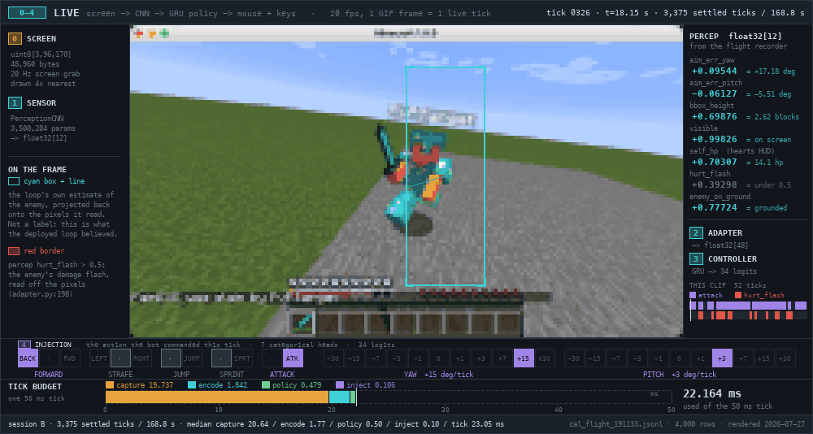
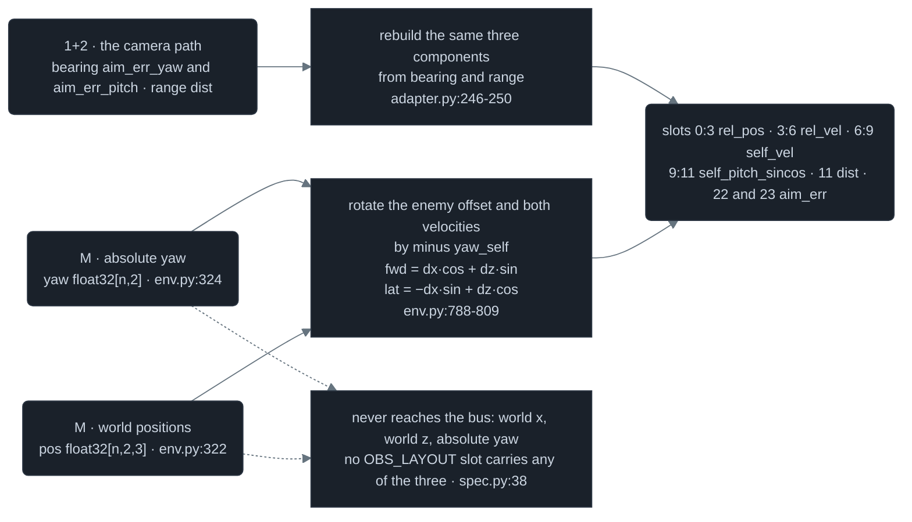
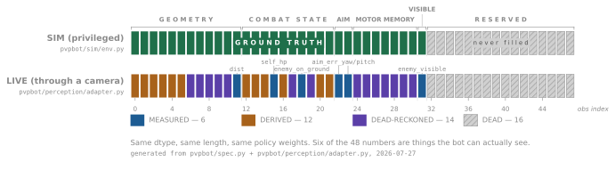
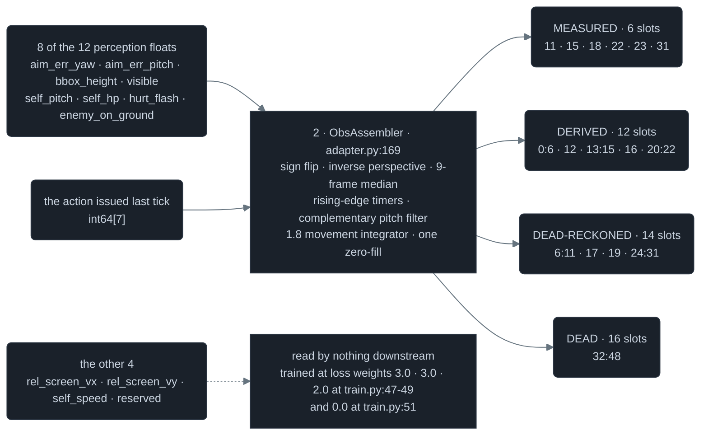

# 01 · Interfaces — every wire, and one tick traced through them

Five stages and one contract in the middle: a 48,960-byte screenshot becomes 12 floats, becomes 48 floats, becomes 7 integers, twenty times a second.



<sub><b>52 consecutive live ticks of the deployed loop, one GIF frame per 50 ms game tick.</b> The captured Minecraft frame at 4x nearest, the cyan box the loop's own perception estimate projects back onto those pixels, the seven heads it commanded, and where tick 326's 22.164 ms went inside a 50 ms budget — capture 19.737, encode 1.842, policy 0.479, inject 0.106. — <i>live, through the pixel pipeline; the paired frames-plus-telemetry run, 3,375 settled ticks / 168.8 s</i> — <code>tools/figures/anim_live_pixels_tick.py</code> · <code>docs/assets/data/live-pixels-tick.json</code> · <i>52 frames @ 20 fps</i></sub>

A *tick* is Minecraft's simulation step: 1/20 s, 50 ms, and every rule in the game is expressed per tick (`pvpbot/spec.py:7`). Frame 0 of that clip is log tick 326. This page takes that one tick apart.

## The bus, exploded

```mermaid
%%{init:{'theme':'base','themeVariables':{'background':'#12161c','primaryColor':'#1a212a','primaryTextColor':'#ccd6e2','primaryBorderColor':'#2b3542','lineColor':'#66747f','secondaryColor':'#1a212a','tertiaryColor':'#12161c','textColor':'#ccd6e2','edgeLabelBackground':'#1a212a','fontFamily':'ui-monospace,SFMono-Regular,Menlo,monospace','fontSize':'13px'}}}%%
flowchart LR
  scr("0 · screen<br/>uint8[3,96,170] · 48,960 B")
  cnn["1 · PerceptionCNN<br/>models.py:57"]
  pvec("float32[12]<br/>PERCEPTION_LAYOUT")
  ada["2 · ObsAssembler<br/>adapter.py:169"]
  ovec("float32[48]<br/>OBS_LAYOUT · self-yaw frame")
  pol["3 · PolicyNet<br/>models.py:14"]
  avec("int64[7]<br/>ACTION_HEADS")
  inj["4 · QuartzInputSink<br/>input_inject.py:228"]
  hid("key edges + relative mouse delta<br/>degrees to pixels")
  sim["M · DuelVecEnv<br/>sim/env.py:777"]

  scr -->|"3.5M params · 8,640-wide flatten"| cnn
  cnn --> pvec
  pvec -->|"8 of 12 slots read"| ada
  ada --> ovec
  ovec -->|"231,075 params · 34 logits"| pol
  pol --> avec
  avec -->|"assist on heads 5-6 · 3-tick latch on heads 0,1,3"| inj
  inj --> hid
  sim -->|"the identical float32[48], two sides per env"| ovec
  avec -.->|"prev_action into slots 24:31"| ada
```



*Two producers, one consumer: the CNN-plus-adapter path and the NumPy simulator both emit `float32[48]` laid out by `OBS_LAYOUT`, and `PolicyNet` cannot tell which one it is reading.*



*One rotation is the whole trick. The simulator holds absolute positions and yaw and turns them into a bearing; the camera path has nothing but a bearing to begin with. Both land in the same slots, and neither writes a world coordinate or an absolute yaw.*

The observation is purely egocentric. `pvpbot/sim/env.py:793` rotates the enemy offset and both velocity vectors into the observer's own yaw frame before writing them, and pitch enters only as `sin`/`cos` at `env.py:813`; absolute yaw appears in no slot, and neither does world position. That is exactly what makes a camera able to fill the same 48 floats: a screen shows where the enemy sits relative to the crosshair and never gives world coordinates, so the vector describes a relationship rather than a place.

## Forty-eight floats



<sub><b>The same 48 slots, twice: what the simulator writes, and what the camera path can recover.</b> Each cell in the lower strip is coloured by the line of <code>ObsAssembler.update</code> that writes it — MEASURED 6, DERIVED 12, DEAD-RECKONED 14, DEAD 16. — <i>generated from the layout and the adapter source, not from a run</i> — <code>tools/figures/fig_obs_provenance_strip.py</code></sub>

`OBS_LAYOUT` maps 20 names to half-open `(start, stop)` pairs that tile `[0, 48)` (`pvpbot/spec.py:38`). Neither writer hardcodes an integer: the simulator builds `_S = {name: se[0] for name, se in OBS_LAYOUT.items()}` and writes through it (`pvpbot/sim/env.py:60`), and the live adapter writes `obs[s:e]` slices by name (`adapter.py:298-337`). Divisors are printed once, here, and applied silently everywhere after: a 1.0 in slot 11 means 8 blocks, and a 1.0 in slot 13 means 10 ticks, half a second of *hurt-time*, the invulnerability window a player gets after taking a hit.

<details>
<summary>All 20 named slots: index range, units, divisor, what a 1.0 means, and both write sites (20 rows)</summary>

| Index | Name | Units | Divisor | A 1.0 means | Source |
|---:|---|---|---:|---|---|
| 0:3 | rel_pos | blocks, self-yaw frame `[forward, up, lateral]` | 8 | the enemy is 8 blocks away along that axis | `sim/env.py:793` · `adapter.py:299` |
| 3:6 | rel_vel | blocks/tick | 1 | enemy-minus-self velocity of 1 block/tick = 20 blocks/s | `sim/env.py:800` · `adapter.py:301` |
| 6:9 | self_vel | blocks/tick | 1 | own speed of 1 block/tick along that axis | `sim/env.py:807` · `adapter.py:303` |
| 9:11 | self_pitch_sincos | sin, cos of camera pitch | 1 | `sin = 1.0` is straight up; the sim is up-positive | `sim/env.py:813` · `adapter.py:306` |
| 11 | dist | blocks | 8 | 8 blocks, feet to feet | `sim/env.py:817` · `adapter.py:308` |
| 12 | in_reach | flag | 1 | the enemy is inside the 3.0-block reach test | `sim/env.py:818` · `adapter.py:310` |
| 13 | self_hurt | ticks | 10 | 10 ticks = 0.5 s of own hurt-time remaining | `sim/env.py:820` · `adapter.py:312` |
| 14 | enemy_hurt | ticks | 10 | the enemy's full 10-tick hurt window is open | `sim/env.py:837` · `adapter.py:314` |
| 15 | self_hp | hp | 20 | full health | `sim/env.py:821` · `adapter.py:316` |
| 16 | enemy_hp | hp | 20 | the enemy is at full health | `sim/env.py:838` · `adapter.py:318` |
| 17 | self_on_ground | flag | 1 | feet on the ground | `sim/env.py:822` · `adapter.py:320` |
| 18 | enemy_on_ground | flag | 1 | the enemy is grounded | `sim/env.py:823` · `adapter.py:322` |
| 19 | self_sprinting | flag | 1 | sprint is engaged this tick | `sim/env.py:824` · `adapter.py:324` |
| 20 | ticks_since_hit_dealt | ticks, capped 100 | 100 | 100 ticks = 5 s since the last landed hit | `sim/env.py:839` · `adapter.py:326` |
| 21 | ticks_since_hit_taken | ticks, capped 100 | 100 | 100 ticks = 5 s since the last hit taken | `sim/env.py:825` · `adapter.py:328` |
| 22 | aim_err_yaw | degrees, signed | 180 | 180 deg off — the enemy is directly behind the crosshair | `sim/env.py:844` · `adapter.py:330` |
| 23 | aim_err_pitch | degrees, signed, up-positive | 90 | the enemy centre is 90 deg above the crosshair | `sim/env.py:845` · `adapter.py:332` |
| 24:31 | prev_action | head index | that head's own size | unreachable by construction: the max is `(size − 1)/size`, so 10/11 on a camera head | `sim/env.py:848` · `adapter.py:337` |
| 31 | enemy_visible | flag | 1 | the enemy is inside the camera cone this tick | `sim/env.py:863` · `adapter.py:334` |
| 32:48 | reserved | — | — | nothing: 16 slots that are always exactly 0.0 | `sim/env.py:943` · `adapter.py:338` |

</details>

Slot 12 carries three descriptions worth keeping straight, and *reach* (the maximum distance at which a swing can connect at all) is worth pinning down exactly. The actual hit test, an eye-ray against the 0.6 × 1.8 hitbox, is a separate computation that lives on [02 · Physics engine](02-physics-engine.md); slot 12 is only the cheap proximity flag that rides the bus.

| Where | The `in_reach` test | Source |
|---|---|---|
| `spec.py` comment | "1.0 if enemy hittable (dist < 3.0 & LOS)" | `pvpbot/spec.py:44` |
| `DuelVecEnv` | feet-to-feet 3-D distance < `reach` 3.0, with no line-of-sight term, because the arena is flat and featureless | `pvpbot/sim/env.py:818`, `env.py:81` |
| `ObsAssembler` | `visible` **and** the EMA distance estimate < 3.0 | `pvpbot/perception/adapter.py:310` |

Slots 32:48 are never written on either side, and the trained normalizer agrees: in `runs/fov1/ckpt_32.8B_faithful78.pt` the observation normalizer's mean over indices 32:48 is exactly 0.0 and its variance at most 3.05e-15 (`python3 -c "import torch; b=torch.load('runs/fov1/ckpt_32.8B_faithful78.pt', weights_only=False); print(b['obs_norm']['var'][32:48].abs().max())"`). `RunningNorm.normalize` divides by `sqrt(var + 1e-8)` and clips to ±10 (`pvpbot/train/ppo.py:57`), so the one-line zero-fill at `adapter.py:296` is what keeps that third of the vector inert.

## Seven heads, thirty-four logits

| Head | Name | Size | What each index means | Source |
|---:|---|---:|---|---|
| 0 | forward | 3 | 0 back · 1 none · 2 forward | `pvpbot/spec.py:18` |
| 1 | strafe | 3 | 0 left · 1 none · 2 right | `pvpbot/spec.py:19` |
| 2 | jump | 2 | 0 no · 1 jump this tick | `pvpbot/spec.py:20` |
| 3 | sprint | 2 | 0 no · 1 sprint held | `pvpbot/spec.py:21` |
| 4 | attack | 2 | 0 no · 1 swing this tick | `pvpbot/spec.py:22` |
| 5 | yaw | 11 | index into `CAMERA_BINS` → yaw delta in deg/tick | `pvpbot/spec.py:23` |
| 6 | pitch | 11 | index into `CAMERA_BINS` → pitch delta in deg/tick | `pvpbot/spec.py:24` |

The sizes `(3,3,2,2,2,11,11)` multiply out to 8,712 distinct joint actions, and the network never enumerates one of them: it emits `3+3+2+2+2+11+11 = 34` logits from seven independent `Linear(128, n)` heads and samples each head from its own `Categorical` (`pvpbot/models.py:27`, `pvpbot/models.py:53`). There is no attack cooldown anywhere in the action space: the attack head firing every tick would be 20 *CPS*, the standard clicks-per-second unit of 1.8 PvP, so click cadence is a property of the agent, never of the wire.

<details>
<summary>all 11 camera bins, in degrees per tick and per second</summary>

| Bin | Value, deg/tick | deg/s at 20 tps | Gap from the previous bin | mu-law fit, mu = 20 |
|---:|---:|---:|---:|---:|
| 0 | −30 | −600 | — | −30.00 |
| 1 | −15 | −300 | 15 | −15.63 |
| 2 | −7 | −140 | 8 | −7.82 |
| 3 | −3 | −60 | 4 | −3.57 |
| 4 | −1 | −20 | 2 | −1.26 |
| 5 | 0 | 0 | 1 | 0.00 |
| 6 | +1 | +20 | 1 | +1.26 |
| 7 | +3 | +60 | 2 | +3.57 |
| 8 | +7 | +140 | 4 | +7.82 |
| 9 | +15 | +300 | 8 | +15.63 |
| 10 | +30 | +600 | 15 | +30.00 |

</details>

*`CAMERA_BINS` (`pvpbot/spec.py:30`), and in the last column a mu-law companding curve with mu = 20 sampled at 11 uniform points (`30·((1+mu)^t − 1)/mu` for `t` in `0, 0.2 … 1.0`) whose largest deviation from the table is 0.82 deg (`python3 -c "print([30*(21**(i/5)-1)/20 for i in range(6)])"`).*

```text
                     1 character = 1 deg/tick, signed
CAMERA_BINS          |              |       |   | ||| |   |       |              |
bin index            0              1       2   3 456 7   8       9             10
deg/tick             -30           -15      -7  -3 0  +3  +7     +15           +30

a 0.6-block hitbox                           <===========> 11.42 deg
at 3.0 blocks                                5 of the 11 mu-law bins land inside it

a linear 11-bin      :     :     :     :     :     :     :     :     :     :     :
split of the same    -30        -18          -6          +6         +18        +30
+/-30, step 6 deg                            1 of its 11 bins does
```

<sub><b>The eleven camera bins on a signed deg/tick axis, against a linear split of the same range.</b> The band is the angular width the target itself occupies: a 0.6-block hitbox at 3.0 blocks, 11.42 deg. — <i>drawn from the constant, no run data</i> — <code>pvpbot/spec.py:30</code></sub>

The extreme bin is 30 deg/tick × `TICK_RATE` 20 = **600 deg/s** (`pvpbot/spec.py:7`), which is exactly the rotation cap of the hardest scripted opponent in the ladder (`pvpbot/eval/practice.py:228`), so the learner can match that turn rate and never exceed it. Inside that range the log spacing spends resolution where a crosshair needs it: the ±1 and ±3 bins are the ones fine enough to hold the aim inside the box, while the ±15 and ±30 bins reacquire a target that has left the frame.

## Twelve floats become forty-eight



*Eight perception floats and one issued action are everything the live path has; the conditioner in the middle is what turns them into all 48.*

The distance channel is the one inversion in the stack. `dist_from_bbox_height` is the exact algebraic inverse of the renderer's `bbox_height_frac`: both are the angular height of a 1.8-block player expressed as a fraction of the 96-row frame (`pvpbot/perception/synth.py:62-74`), and it is the single authority the live adapter and the dataset labeler both call. At tick 326 it turned `bbox_height 0.69876` into 2.623 blocks, and the α = 0.5 EMA at `adapter.py:228` carried the running estimate to the 2.894 blocks that landed in slot 11.

<details>
<summary>all 12 perception slots: units, loss weight, and who reads each</summary>

| Slot | Name | Units | Loss weight | Read by the adapter | Lands in | Source |
|---:|---|---|---:|---|---|---|
| 0 | aim_err_yaw | degrees / 180, signed | 6.0 | yes | 22, and the `rel_pos` / `rel_vel` geometry | `spec.py:69` · `adapter.py:182` |
| 1 | aim_err_pitch | degrees / 90, **down-positive** | 6.0 | yes, sign-flipped | 23, and the pitch used for `rel_pos[1]` | `adapter.py:187` |
| 2 | bbox_height | enemy box height / frame height | 6.0 | yes | 11 by inverse perspective, then 12, 0:3, 3:6 | `adapter.py:226` |
| 3 | visible | probability | 1.0 | yes, thresholded at 0.5 | 31, and gates 22 / 23 / 12 | `adapter.py:181` |
| 4 | self_pitch | degrees / 90, down-positive | 1.5 | yes, sign-flipped, gain 0.15 | 9:11 | `adapter.py:216` |
| 5 | self_hp | hp / 20 | 1.0 | yes, 9-frame median | 15, and triggers 13 / 21 | `adapter.py:189` |
| 6 | hurt_flash | flag | 1.0 | yes, rising edge only | 14, 16, 20 | `adapter.py:198` |
| 7 | rel_screen_vx | px/tick | 3.0 | no | — | `spec.py:76` · `train.py:47` |
| 8 | rel_screen_vy | px/tick | 3.0 | no | — | `spec.py:77` · `train.py:48` |
| 9 | self_speed | blocks/tick | 2.0 | no | — | `spec.py:78` · `train.py:49` |
| 10 | enemy_on_ground | flag | 1.0 | yes, thresholded at 0.5 | 18 | `adapter.py:322` |
| 11 | reserved | — | 0.0 | no | — | `spec.py:80` · `train.py:51` |

</details>

*`PERCEPTION_LAYOUT` (`pvpbot/spec.py:68`) against the per-slot loss weights the CNN is trained under (`pvpbot/perception/train.py:35`). The adapter reads indices 0, 1, 2, 3, 4, 5, 6 and 10 — eight of the twelve.*

Everything the bot knows about *itself* below the camera comes from the action it issued rather than from a sensor: `adapter.py:124-166` runs a copy of the stub 1.8 movement integrator, with the constants at `adapter.py:68-72` (friction 0.546, accel 0.1, sprint multiplier 1.3, jump velocity 0.42, gravity 0.08) over its own keystrokes, and that fills `self_vel`, `self_on_ground`, `self_sprinting` and `prev_action`. The sensor that produces the twelve inputs, and the conditioner taken apart one filter at a time, are on [03 · Sensor](03-sensor.md).

## The checkpoint contract

<details>
<summary>the checkpoint dict, key by key</summary>

| Key | In the `spec.py` comment | Written by the trainer | What it holds | Source |
|---|---|---|---|---|
| `model` | yes | yes | `PolicyNet.state_dict()`, 231,075 parameters | `spec.py:93` · `train/run.py:137` |
| `meta` | yes | yes | `obs_dim`, `action_heads`, `step`, `elo` | `spec.py:94` · `train/run.py:138` |
| `optimizer` | no | yes | Adam state | `train/run.py:144` |
| `obs_norm` | no | yes | the running mean/var the policy was trained behind | `train/run.py:145` |
| `league` | no | yes | the frozen opponent pool | `train/run.py:146` |
| `update` | no | yes | update counter, for resume | `train/run.py:147` |
| `pin_stage` | no | when a curriculum is pinned | current curriculum rung | `train/run.py:150` |

</details>

`obs_norm` is not optional: `pvpbot/eval/arena.py:98` rebuilds a `RunningNorm` from it on load and `arena.py:118` applies it to every observation inside `act()`, before the forward pass. A real file confirms the superset: `runs/fov1/ckpt_32.8B_faithful78.pt` carries top-level keys `['league','meta','model','obs_norm','optimizer','update']` and `meta = {'obs_dim': 48, 'action_heads': the 7-tuple, 'step': 32799457280, 'elo': 5943.62}` (`python3 -c "import torch; b=torch.load('runs/fov1/ckpt_32.8B_faithful78.pt', weights_only=False); print(sorted(b), b['meta'])"`).
