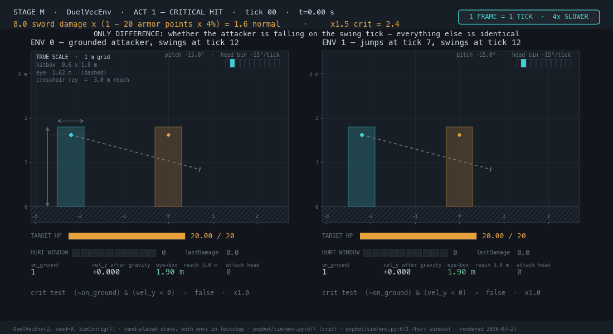
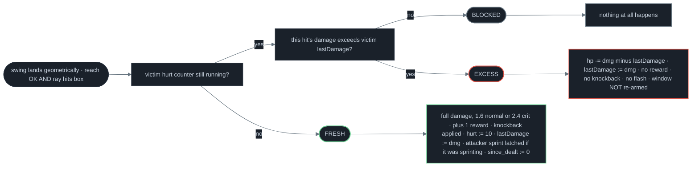
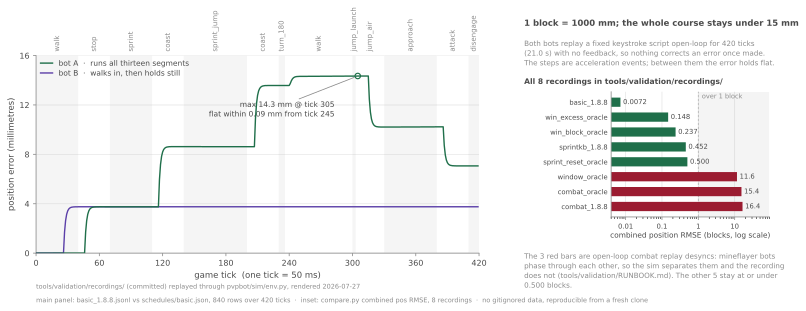

# 02 · Physics engine — 1.8 combat, reimplemented and bench-tested



<sub><b>Two 1.8 combat rules isolated at one frame per tick.</b> Two `DuelVecEnv` instances stepped in lockstep, one per panel — in Act 1 both attackers swing on tick 12 and only env 1 is airborne with vel_y −0.075, so it deals 2.4 instead of 1.6; in Act 2 both second swings connect at tick 10 inside a window opened by 1.6, and only the crit pushes its 0.8 excess through, while the ten-segment bar keeps counting down either way. — <i>DuelVecEnv(2, seed=0, SimConfig), hand-placed state, aim solved through the real 11-bin camera head</i> — <code>pvpbot/sim/env.py:677</code> · <code>pvpbot/sim/env.py:671</code> · <i>55 frames @ 5 fps, 1 frame = 1 tick, 4x slower than real time</i></sub>

[`pvpbot/sim/env.py`](../pvpbot/sim/env.py) is 945 lines of NumPy that reimplement Minecraft 1.8's movement and melee tick, and every rule below is expressed per tick. State lives in arrays shaped `(num_envs, 2,...)` — N independent duels, two players each, so one `step` call advances every duel at once with no Python loop over environments. It is the mirror half of the machine: it emits the identical `float32[48]` observation vector a CNN reads off a real screen, at millions of vectors per second. The wire format itself — every slot, its divisor and its frame of reference — is [01 · Interfaces](01-interfaces.md).

## The tick

```mermaid
%%{init:{'theme':'base','themeVariables':{'background':'#12161c','primaryColor':'#1a212a','primaryTextColor':'#ccd6e2','primaryBorderColor':'#2b3542','lineColor':'#66747f','secondaryColor':'#1a212a','tertiaryColor':'#12161c','textColor':'#ccd6e2','edgeLabelBackground':'#1a212a','fontFamily':'ui-monospace,SFMono-Regular,Menlo,monospace','fontSize':'13px'}}}%%
flowchart TB
 IN(["actions · int64[N,2,7]"])

 subgraph KNOBS["learner-side action artifacts · side 0 only · off by default"]
 direction TB
 K1["act_delay ring buffer · env.py:445"]
 K2["act_hold latch on forward, strafe, sprint · env.py:451"]
 K3["cam_assist overrides the yaw and pitch heads · env.py:463"]
 K1 --> K2 --> K3
 end

 S1["1 · camera · yaw += bin, pitch += bin clamped to plus/minus 90 · env.py:497"]
 K4["1b · aim_exec_noise · OU bias added to side-0 yaw · env.py:508"]
 S2["2 · sprint latch · want = sprint key AND forward; blocked = blocked AND want; sprinting = want AND NOT blocked · env.py:517"]
 S3["3 · jump · vy = 0.42, plus 0.2 along yaw if sprinting · env.py:525"]
 S4["4 · movement accel · ground 0.1 x 0.16277 / 0.546 cubed, air 0.02, x1.3 if sprinting, diagonal renormalised · env.py:532"]
 S5["5 · integrate · pos += vel, floor clamp y at 0, arena wall clamp · env.py:546"]
 S6["6 · gravity vy = (vy - 0.08) x 0.98 if airborne; horizontal x friction chosen from the PRE-move ground state, 0.546 or 0.91 · env.py:570"]
 S7["6b · player-player shove 0.10 · env.py:578"]

 subgraph CBT["7 · combat · env.py:603"]
 direction TB
 C1["eye-to-target-AABB distance at most 3.0 · env.py:615"]
 C2["ray-vs-AABB slab test through the 0.8 x 2.0 x 0.8 clickable box · env.py:640"]
 C3["attack head equals 1 · env.py:667"]
 C4["hit_reg_prob dice · side 0 only · env.py:669"]
 C5["landed · split into fresh and excess · env.py:681"]
 C1 --> C2 --> C3 --> C4 --> C5
 end

 S8["8 · rewards · env.py:733"]
 S9["9 · termination · dead OR tick at 1200 · env.py:761"]
 S10["auto-reset done envs · env.py:773"]
 S11["_obs · fill all 48 slots for both sides · env.py:777"]
 K5["obs_delay ring buffer · env.py:421"]
 OUT(["obs float32[N,2,48] · rew · done · info"])

 IN -.-> K1
 IN --> S1
 K3 -.-> S1
 S1 -.-> K4
 K4 -.-> S2
 S1 --> S2 --> S3 --> S4 --> S5 --> S6 --> S7 --> C1
 C5 --> S8 --> S9 --> S10 --> S11
 S11 --> OUT
 S11 -.-> K5
 K5 -.-> OUT

 classDef knob stroke:#a184e8,stroke-width:1.5px,stroke-dasharray:5 4;
 class K1,K2,K3,K4,K5 knob;
```



*Solid = vanilla-faithful physics, in the order `EntityLivingBase.onLivingUpdate` runs it. Dashed violet = deliberately-injected live-pipeline imperfection, every knob defaulting to off; the names them all.*

One ordering detail carries the whole movement model. Vanilla picks a tick's horizontal friction from the on-ground state at the **start** of the tick: `was_grounded = self.on_ground` is snapshotted before the position integrates (`pvpbot/sim/env.py:546-551`) and applied after (`pvpbot/sim/env.py:574`), so the tick you press jump still eats ground friction, 0.6 × 0.91 = 0.546, and only 0.109 of the 0.2 sprint-jump boost survives it. The landing tick, symmetrically, still gets air drag 0.91.

## The constants

| What a duel is made of | Value | Unit | How it comes out of the constants | Source |
| --- | ---: | --- | --- | --- |
| normal hit | 1.6 | hp | `attack_damage 8.0 × (1 − 20 × 0.04)` | `pvpbot/sim/env.py:281` |
| critical hit | 2.4 | hp | `1.6 × crit_mult 1.5`, thrown airborne and falling | `pvpbot/sim/env.py:282` |
| clean hits to a kill | 13 | hits | `ceil(20.0 hp / 1.6)` | `pvpbot/sim/env.py:190` |
| full-value hit cadence | 11 | ticks | the 10-tick hurt window plus the tick the swing lands on — 1.82 hits/s | `tests/test_sim_physics.py:157` |
| walk, steady state | 0.2159 | blocks/tick | ground accel 0.100000 against friction 0.546 — 4.32 blocks/s | `pvpbot/sim/env.py:263` |
| sprint, steady state | 0.2806 | blocks/tick | the same lane × `sprint_mult` 1.3 — 5.61 blocks/s | `pvpbot/sim/env.py:75` |

*Everything that happens in a fight reduces to these six; the 33 constants below are what produce them.*

<details>
<summary><b>33 constants — every physics and combat number the tick uses, with its source line</b></summary>

| Constant | Value | Unit | What it is | Source |
| --- | ---: | --- | --- | --- |
| `reach` | 3.0 | blocks | eye to nearest point of the target AABB, not centre to centre | `pvpbot/sim/env.py:81` |
| `eye_height` | 1.62 | blocks | ray origin above the feet | `pvpbot/sim/env.py:82` |
| `hitbox_half_width` | 0.3 | blocks | player AABB is 0.6 wide | `pvpbot/sim/env.py:83` |
| `hitbox_height` | 1.8 | blocks | player AABB height | `pvpbot/sim/env.py:84` |
| `click_border` | 0.1 | blocks | `Entity.getCollisionBorderSize` expansion on every axis; clickable box is 0.8 × 2.0 × 0.8 | `pvpbot/sim/env.py:108` |
| `attack_damage` | 8.0 | hp | 1.8 diamond sword (7.0 is the 1.9 rebalance) | `pvpbot/sim/env.py:85` |
| `armor_points` | 20.0 | points | full diamond | `pvpbot/sim/env.py:88` |
| `armor_reduction_per_point` | 0.04 | fraction/point | 20 × 4% = 80% total reduction | `pvpbot/sim/env.py:89` |
| normal hit (derived) | 1.6 | hp | `attack_damage × (1 − 0.04 × 20)` | `pvpbot/sim/env.py:281` |
| `crit_mult` | 1.5 | × | airborne and falling | `pvpbot/sim/env.py:90` |
| critical hit (derived) | 2.4 | hp | `1.6 × 1.5` | `pvpbot/sim/env.py:282` |
| `max_hp` | 20.0 | hp | 13 clean normal hits to kill | `pvpbot/sim/env.py:190` |
| `hurt_ticks` | 10 | ticks | post-hit invulnerability window | `pvpbot/sim/env.py:91` |
| `kb_horizontal` | 0.4 | blocks/tick | base knockback along attacker → victim, added *after* the victim's velocity is halved on all three axes | `pvpbot/sim/env.py:92` |
| `kb_vertical` | 0.4 | blocks/tick | base vertical knockback, likewise added after the halving | `pvpbot/sim/env.py:93` |
| `kb_vertical_cap` | 0.4 | blocks/tick | ceiling on the *resulting* vertical velocity, not on the impulse | `pvpbot/sim/env.py:94` |
| `sprint_kb_horizontal` | 0.5 | blocks/tick | sprint-hit extra, additive along the attacker's facing | `pvpbot/sim/env.py:100` |
| `sprint_kb_vertical` | 0.06 | blocks/tick | sprint-hit vertical extra | `pvpbot/sim/env.py:101` |
| `sprint_hit_slowdown` | 0.6 | × | attacker's own horizontal velocity on a sprint hit | `pvpbot/sim/env.py:102` |
| `ground_slipperiness` | 0.6 | × | ground friction is `× 0.91` = 0.546 per tick | `pvpbot/sim/env.py:68` |
| `air_drag_h` | 0.91 | × | horizontal drag while airborne | `pvpbot/sim/env.py:70` |
| `gravity` | 0.08 | blocks/tick² | subtracted from vy each airborne tick | `pvpbot/sim/env.py:72` |
| `y_drag` | 0.98 | × | applied after gravity; fixed point is −3.92 blocks/tick | `pvpbot/sim/env.py:71` |
| `jump_velocity` | 0.42 | blocks/tick | `motionY` set on jump | `pvpbot/sim/env.py:77` |
| `sprint_jump_boost` | 0.2 | blocks/tick | horizontal boost along yaw on a sprint jump | `pvpbot/sim/env.py:78` |
| `walk_speed` | 0.1 | — | `movementSpeed` attribute | `pvpbot/sim/env.py:73` |
| `air_accel` | 0.02 | — | `jumpMovementFactor` | `pvpbot/sim/env.py:74` |
| `sprint_mult` | 1.3 | × | sprint is +30% movement speed | `pvpbot/sim/env.py:75` |
| `input_scale` | 0.98 | — | keyboard input magnitude, 1.8 client | `pvpbot/sim/env.py:76` |
| `collision_push` | 0.10 | blocks/tick | vanilla's 0.05 applied twice, once per entity update | `pvpbot/sim/env.py:188` |
| `arena_radius` | 8.0 | blocks | hard wall; half-side when `arena_square` | `pvpbot/sim/env.py:180` |
| `spawn_radius` | 6.0 | blocks | spawn uniform in this disc | `pvpbot/sim/env.py:184` |
| `max_ticks` | 1200 | ticks | 60 s at 20 tps; timeout is a draw | `pvpbot/sim/env.py:189` |

*`SimConfig` carries two more combat fields that the tick never reads: `aim_pad` 0.15 and `aim_slack_deg` 10.0 (`pvpbot/sim/env.py:103-104`), bound into `self._aim_hw`, `self._aim_hh` and `self._slack` at `pvpbot/sim/env.py:291-293` and referenced nowhere else. They are the padded cone that the exact ray at `pvpbot/sim/env.py:625-668` replaced.*

</details>

```text
STEADY-STATE GROUND SPEED -- blocks moved per 50 ms tick, keys held to convergence

 0 0.05 0.10 0.15 0.20 0.25 0.30 blocks/tick
 |---------|---------|---------|---------|---------|---------|
 walk W ########################################### 0.2159 4.32 blocks/s
 diagonal W+A ############################################ 0.2203 4.41 blocks/s +2.0% over walk
 sprint W+sprint ######################################################## 0.2806 5.61 blocks/s x1.30000 over walk
 un-renormalised W+A............................................................. 0.3053 6.11 blocks/s +41.4%, and NOT what the sim does
```

*Displacement per tick after 600 ticks of held keys, `DuelVecEnv(1, seed=0, SimConfig(collision_push=0.0))`, measured off `pos` rather than `vel` because position integrates before friction. The dotted row is the hypothetical: `0.2159 × √2`, what two keys would buy if the diagonal were not renormalised.*

Ground acceleration is 1.8's `movementSpeed × 0.16277136 / friction³` (`pvpbot/sim/env.py:263`), which at the default slipperiness (`0.6 × 0.91 = 0.546`) evaluates to exactly 0.100000. The diagonal is held to a 2% edge, not 41%, by dividing that acceleration by `max(|input|, 1)` before it is rotated into world axes (`pvpbot/sim/env.py:540`): pressing W+A spreads one tick's acceleration across two axes instead of stacking a full 0.098 on each.

## The click test

<details>
<summary>the click test, worked through tick by tick</summary>

```text
CLICK ENVELOPE -- 81 centre-to-centre distances (0.60-4.60 blocks, 0.05 grid) x 101 yaw
offsets (-25.0 to +25.0 deg, 0.5 grid) = 8,181 cells, one vectorized step, 3,569 land.
# the swing connects. it misses
Exactly symmetric in yaw sign, so only the >= 0 half is drawn, every 1.0 deg.

 1.00 2.00 3.00 4.00 last hit atan model
yaw off, deg v v v v blocks blocks
 0.0 #######################################################.......................... 3.30 3.30
 1.0 #######################################################.......................... 3.30 3.30
 2.0 #######################################################.......................... 3.30 3.30
 3.0 #######################################################.......................... 3.30 3.30
 4.0 #######################################################.......................... 3.30 3.30
 5.0 #######################################################.......................... 3.30 3.30
 6.0 #######################################################.......................... 3.30 3.30
 7.0 #######################################################.......................... 3.30 3.30
 8.0 #####################################################............................ 3.20 3.25
 9.0 ###############################################.................................. 2.90 2.93
 10.0 ##########################################....................................... 2.65 2.67
 11.0 ######################################........................................... 2.45 2.46
 12.0 ##################################............................................... 2.25 2.28
 13.0 ###############################.................................................. 2.10 2.13
 14.0 #############################.................................................... 2.00 2.00
 15.0 ##########################....................................................... 1.85 1.89
 16.0 ########################......................................................... 1.75 1.79
 17.0 #######################.......................................................... 1.70 1.71
 18.0 #####################............................................................ 1.60 1.63
 19.0 ####################............................................................. 1.55 1.56
 20.0 ##################............................................................... 1.45 1.50
 21.0 #################................................................................ 1.40 1.44
 22.0 ################................................................................. 1.35 1.39
 23.0 ###############.................................................................. 1.30 1.34
 24.0 ##############................................................................... 1.25 1.30
 25.0 ##############................................................................... 1.25 1.26
 ^
 REACH CLIFF -- 3.30 blocks is the last distance that connects at ANY offset, and 3.35
 misses all 101, because reach is measured eye-to-near-face, not centre-to-centre.
```

</details>

*Two edges, and they are different edges. The vertical one at 3.30 is `reach`; the staircase above 8° is the ray leaving the box, and the `atan model` column is `atan(0.4 / (d − 0.4))` solved for distance and clipped at the 3.30 reach limit — every measured edge lands inside one 0.05-block grid step of it. Below 8° the ray still hits the box out past 3.30, so reach is what stops the swing; above 8° the geometry stops it first.*

<details>
<summary>centre-to-centre against eye-to-AABB distance, tabulated</summary>

| Centre-to-centre distance (blocks) | Eye-to-AABB distance (blocks) | Measured connecting yaw window (deg) | Prediction `atan(0.4 / (d − 0.4))` (deg) | Source |
| ---: | ---: | ---: | ---: | --- |
| 1.00 | 0.70 | ≥ ±25.0 | ±33.69 | `pvpbot/sim/env.py:640` |
| 1.50 | 1.20 | ±19.5 | ±19.98 | `pvpbot/sim/env.py:640` |
| 2.00 | 1.70 | ±14.0 | ±14.04 | `pvpbot/sim/env.py:640` |
| 2.50 | 2.20 | ±10.5 | ±10.78 | `pvpbot/sim/env.py:640` |
| 3.00 | 2.70 | ±8.5 | ±8.75 | `pvpbot/sim/env.py:640` |
| 3.25 | 2.95 | ±7.5 | ±7.99 | `pvpbot/sim/env.py:640` |
| 3.30 | 3.00 | ±7.5 | ±7.85 | `pvpbot/sim/env.py:640` |
| 3.35 | 3.05 | none | — | `pvpbot/sim/env.py:668` |

</details>

*The same sweep read column-wise: the widest offset that still connects at each distance, with pitch solved onto the target's chest and the attack head held at 1. At 1.00 block the entire ±25.0° sweep column connects, so that row is bounded by the sweep rather than by the geometry; every other measured window sits within one 0.5° grid step of the tangent line to the near corner of the clickable box.*

A swing lands only if the eye-to-target-AABB distance is at most 3.0 blocks **and** the crosshair ray from the eye at 1.62 slab-intersects the target's 0.6 × 1.8 box expanded by `click_border` 0.1 on every axis (`pvpbot/sim/env.py:625-668`): an exact ray against a 0.8 × 2.0 × 0.8 box, not a forgiving cone, with degenerate axes handled by substituting ±∞ slab bounds. That is where the cliff at 3.35 comes from: reach is measured to the *nearest face* of the box, so the last connecting centre-to-centre distance for a level swing is 3.0 + 0.3 = 3.30, and 3.35 misses at every one of the 101 yaw offsets in the sweep.

## The hurt window



*The 1.8 rule from `EntityLivingBase.attackEntityFrom`, implemented at `pvpbot/sim/env.py:671-694`. It is not plain invulnerability: only the excess over `lastDamage` gets through.*

Traced in the sim: a normal 1.6 followed by a critical 2.4 inside the window deals exactly **0.8** (hp 18.40 → 17.60), applies a victim velocity delta of exactly `[0, 0, 0]`, and lets the counter continue 10 → 9 rather than re-arming it. Swinging every tick at a pinned victim lands on tick 1, is blocked on ticks 2 through 11 as the counter walks 10 → 0, and lands again on tick 12: a hard ceiling of one full-value hit per 11 ticks, **1.82 hits/s**, no matter how many clicks per second you can produce. That ceiling is asserted in `tests/test_sim_physics.py:157`.

```text
STANDING JUMP, JUMP KEY HELD THROUGHOUT — end-of-tick state, traced from pvpbot/sim/env.py
tick y (blocks) vy on_ground crit window damage if you swing here
──── ────────── ────── ───────── ─────────── ────────────────────────
 1 0.4200 +0.3332 no no 1.6 jump applied
 2 0.7532 +0.2481 no no 1.6
 3 1.0013 +0.1648 no no 1.6
 4 1.1661 +0.0831 no no 1.6
 5 1.2492 +0.0030 no no 1.6
 6 1.2522 -0.0754 no ██ OPEN ██ 2.4 APEX
 7 1.1768 -0.1523 no ██ OPEN ██ 2.4
 8 1.0244 -0.2277 no ██ OPEN ██ 2.4
 9 0.7967 -0.3015 no ██ OPEN ██ 2.4
 10 0.4952 -0.3739 no ██ OPEN ██ 2.4
 11 0.1213 -0.4448 no ██ OPEN ██ 2.4
 12 0.0000 +0.0000 yes no 1.6 LANDED
```

A **critical hit** in 1.8 is any swing thrown while airborne and descending: `crit = (~on_ground) & (vel_y < 0.0)`, evaluated at `pvpbot/sim/env.py:677` after that tick's gravity has already been applied at `pvpbot/sim/env.py:571`. The window is therefore 6 ticks wide: 300 ms, and opens on the sixth tick of the jump, which is the timing a jump-crit has to hit; the key stays held, so the cycle repeats every 12 ticks. Vertical velocity has a fixed point at −3.92 blocks/tick under `(vy − 0.08) × 0.98`, checked in `tests/test_sim_physics.py:63`.

## Sprint knockback and the W-tap latch

```text
W-TAP LANE — attacker holds sprint, swings every tick, releases W for one tick after each landed hit
tick fwd sprint sprinting blocked event
──── ─── ────── ───────── ─────── ─────────────────────────────────────────
 1 W X yes no SPRINT HIT · victim launched 0.935 b/t
 attacker sprint latched, victim's too
 2 — X no no W released for exactly one tick: latch clears
 3 W X yes no sprint re-engaged, knockback restored
...
 12 W X yes no SPRINT HIT · victim launched 0.972 b/t

HOLD-W LANE — identical, except W is never released
 1 W X yes no SPRINT HIT · victim launched 0.935 b/t
 2 W X no yes holding W does NOT clear the latch
 3 W X no yes still blocked
...
 12 W X no yes NORMAL HIT · victim launched 0.472 b/t
```

Sprint requires the sprint key **and** forward held; a `blocked` latch is set both by landing a sprint hit and by taking damage, and the top of every tick runs `sprint_blocked &= want` (`pvpbot/sim/env.py:522`), which clears the latch only when the player is *not* holding sprint+forward. So one tick of releasing W unblocks it and re-pressing re-engages sprint — that release-and-repress rhythm is the **w-tap**, and modelling it as a latch rather than a timer means the policy has to discover the rhythm rather than receive it. The impulse on the far end is not simply added: 1.8's `knockBack` first **halves the victim's velocity on all three axes** — `keep = 1 − 0.5 × taken` collapses to 0.5 on the hit tick (`pvpbot/sim/env.py:705`, applied at `706-708`) — then adds `kb_horizontal` 0.4 along the attacker → victim horizontal unit vector and `kb_vertical` 0.4 upward, and clamps the *resulting* vertical velocity to 0.4 (`pvpbot/sim/env.py:709`), which is why `kb_vertical_cap` is a ceiling on the outcome rather than on the impulse. A sprint hit then adds 0.5 horizontal along the attacker's *facing* and 0.06 vertical on top of all of that — after the halving, after the clamp, with no second halving (`pvpbot/sim/env.py:711-718`), and slows the attacker's own horizontal velocity to 60%. That order is what the launch column below is made of.

| Landed hit | Hit tick | Victim launch, W-tap lane (blocks/tick) | Victim launch, hold-W lane (blocks/tick) | Source |
| ---: | ---: | ---: | ---: | --- |
| 1 | 1 | 0.935 | 0.935 | `pvpbot/sim/env.py:705-718` |
| 2 | 12 | 0.972 | 0.472 | `pvpbot/sim/env.py:705-718` |
| 3 | 23 | 0.972 | 0.463 | `pvpbot/sim/env.py:705-718` |
| 4 | 34 | 0.972 | 0.463 | `pvpbot/sim/env.py:705-718` |

*Horizontal launch speed on the impact tick. Both lanes are seeded identically at 2.5 blocks with the victim re-spaced every tick, so the latch is the only difference between them. Both land on exactly the same ticks: 1, 12, 23, 34, one per 11-tick hurt window, and both deal exactly 6.4 total damage over 4 hits.*

This is a knockback and spacing difference, not a damage or DPS difference. The hurt window sets the hit rate for both lanes identically; what the w-tap buys is roughly double the launch on every hit after the first, which is spacing, and spacing is what decides who gets the next window.

## Fidelity against a real server



<sub><b>Per-tick position drift against a real PaperSpigot 1.8.8 server.</b> Both bots replay one fixed keystroke script open-loop for 420 ticks (21.0 s) with no feedback, so nothing corrects an error once it is made — one block is 1000 mm and the whole course stays under 15 mm, peaking at 14.3 mm; the inset ranks all eight recordings in `tools/validation/recordings/` by combined position RMSE on a log axis. — <i>schedules/basic.json replayed through the sim, 840 recording rows</i> — <code>tools/validation/recordings/basic_1.8.8.jsonl</code></sub>

The harness makes the comparison airtight by construction. One deterministic JSON input script — per-bot, per-tick key states plus camera deltas in degrees (`tools/validation/harness.py:304`) — is consumed by two independent replayers: [`tools/validation/recorder/record_duel.js`](../tools/validation/recorder/record_duel.js) holds exactly those keys on two mineflayer bots connected to a real PaperSpigot 1.8.8 server, and `harness.build_action_track` maps exactly the same inputs onto the sim's seven action heads (`tools/validation/harness.py:319`), with the Minecraft-to-sim frame conversion isolated in one place, `sim_yaw = (mc_yaw + 90) % 360` (`tools/validation/harness.py:105`). Because the inputs are identical, any residual is provably physics.

<details>
<summary>the full real-server comparison output</summary>

```console
$ python3 tools/validation/compare.py \
 --recording tools/validation/recordings/basic_1.8.8.jsonl \
 --schedule tools/validation/schedules/basic.json --env real

segment bot mechanic ticks n pos_rmse vel_rmse yaw_rmse max_pos_err @tick
---------------------------------------------------------------------------------------------------------
walk_out A walk 0-40 40 0.000001 0.000000 0.000 0.000002 34
stop_decay A stop 40-70 30 0.003142 0.000203 0.000 0.003753 60
sprint_out A sprint 70-110 40 0.003751 0.000000 0.000 0.003753 72
coast_1 A coast 110-140 30 0.007570 0.000264 0.000 0.008626 129
sprint_jump A sprint_jump 140-200 60 0.008622 0.000000 0.000 0.008627 141
coast_2 A coast 200-230 30 0.012245 0.000268 0.000 0.013576 219
turn_180 A turn_180 230-236 6 0.013576 0.000000 0.000 0.013578 233
walk_back A walk 236-300 64 0.014248 0.000168 0.000 0.014344 299
jump_launch A jump_arc 300-303 3 0.014345 0.000000 0.000 0.014345 302
jump_air A jump_arc 303-330 27 0.012532 0.000254 0.000 0.014346 305
approach A approach 330-380 50 0.010217 0.000000 0.000 0.010228 377
attack_window A attack 380-410 30 0.008032 0.000203 0.000 0.010229 386
disengage A coast 410-420 10 0.007066 0.000000 0.000 0.007066 410
b_walk_in B walk 0-20 20 0.000000 0.000000 0.000 0.000001 16
b_hold_victim B knockback_observe 20-420 400 0.003711 0.000056 0.000 0.003754 40
---------------------------------------------------------------------------------------------------------
overall A 0-420 420 0.009530 0.000156 0.000 0.014346 305
overall B 0-420 420 0.003622 0.000054 0.000 0.003754 40

combined pos RMSE (all segments): 0.007209
worst segment by pos RMSE: jump_launch
worst segment by vel RMSE: coast_2

$...same command... --tick-offset -1 | grep combined
combined pos RMSE (all segments): 0.162563
$...same command... --tick-offset 1 | grep combined
combined pos RMSE (all segments): 0.163696
```

</details>

Combined position RMSE over the 420-tick movement course is **0.007209 blocks** (7.2 mm) with the worst segment `jump_launch` at 0.014345 and the largest single-tick error 0.014346 blocks at tick 305. Bot A's velocity RMSE is 0.000156 blocks/tick and yaw RMSE is exactly 0.000° in every one of the fifteen segments (thirteen for bot A, two for bot B): the course's only rotation is `turn_180`, six ticks of 30.0°/tick, which is bin index 10 exactly, so quantising it onto the eleven camera bins is lossless. Tick alignment is unambiguous rather than fitted: offset 0 gives 0.0072 where ±1 gives 0.1626 and 0.1637, a factor of 22 either way.

## Throughput

```text
ENV THROUGHPUT -- millions of env-steps/s; one env-step = one duel advanced one 50 ms tick

 0 0.5 1.0 1.5 2.0 2.5 M env-steps/s ms per step
 |---------|---------|---------|---------|---------|
 1,024 default SimConfig ####################|################ 1.83 0.560
 full faithful stack ################## | 0.91 1.123
 4,096 default SimConfig ####################|############################ 2.43 1.685
 full faithful stack ####################|### 1.18 3.481
 16,384 default SimConfig ####################|############################ 2.43 6.744
 full faithful stack ####################|### 1.21 13.509
 ^ 1.00 M PASS target (pvpbot/sim/bench.py:58)
```

*Widening 1,024 → 4,096 buys 33%; 4,096 → 16,384 buys nothing. The plateau sits at 4,096 duels per `step`, which is exactly the trainer's default width (`pvpbot/train/run.py:496`), and every bar clears the benchmark's own PASS rule with the full realism stack switched on.*

| Duels per `step` | Default `SimConfig` (M env-steps/s) | ms per `step` | Full faithful-knob stack (M env-steps/s) | ms per `step` | Source |
| ---: | ---: | ---: | ---: | ---: | --- |
| 1,024 | 1.83 | 0.560 | 0.91 | 1.123 | `python3 -m pvpbot.sim.bench --envs 1024 --steps 300` |
| 4,096 | 2.43 | 1.685 | 1.18 | 3.481 | `python3 -m pvpbot.sim.bench --envs 4096 --steps 300` |
| 16,384 | 2.43 | 6.744 | 1.21 | 13.509 | `python3 -m pvpbot.sim.bench --envs 16384 --steps 200` |

*Throughput in millions of env-steps per second, one env-step being one duel advanced one 50 ms tick. Measured on an Apple M4 Max, 2026-07-27, python3 3.9.6 / numpy 2.0.2; both columns use the benchmark's own protocol — 30 warm-up calls, 32 pre-generated action batches so RNG cost stays out of the timed loop (`pvpbot/sim/bench.py:32`). Switching on every realism knob at once costs almost exactly 2× at all three widths.*

<details>
<summary><b>the faithful-knob column, verbatim</b></summary>

```python
# same timing protocol as pvpbot/sim/bench.py:32, with the full knob stack on
cfg = SimConfig(fov_limited_obs=True, obs_noise=1.0, obs_delay_ticks=3,
 aim_exec_noise_deg=5.0, rel_vel_noise=0.35, act_delay_ticks=2,
 act_hold_ticks=2, hit_reg_prob=0.61, vis_miss_prob=0.235,
 vis_reacq_prob=0.224, cam_assist=True, mask_dead_senses=True,
 arena_square=True)
env = DuelVecEnv(n, seed=0, config=cfg)
```

</details>

At 4,096 duels the shipped benchmark reports 2.43M env-steps/s against its own 1.00M PASS target (`pvpbot/sim/bench.py:58`), and the whole physics-and-combat suite — jump apex, terminal fall speed, sprint ratio, knockback, hurt window, crits, w-tap, FOV gating, observation delay, reward shaping, API conformance, seed determinism — is 38 tests in 1.22 s (`python3 -m pytest tests/test_sim_*.py tests/test_obs_delay.py -q`). The env-steps figure is the physics alone; the trainer's realised end-to-end rate with policy forward and backward in the loop belongs to [04 · Controller](04-controller.md).
