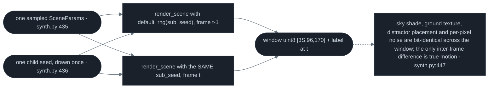
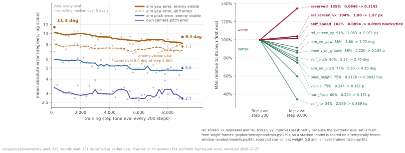
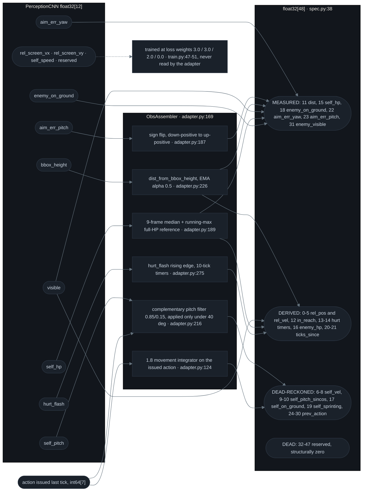

# 03 · Sensor — 96×170 RGB in, twelve floats out

![A real 170x96 Minecraft capture frame shown at 4x nearest-neighbour scale, filling the left of a dark instrument panel headed "STAGE 1 - PerceptionCNN 3,500,204 params". A diamond-armoured opponent stands mid-frame inside a solid amber box marking telemetry ground truth and a dashed cyan box marking the CNN's estimate for that frame. On the right, a "PERCEPTION VECTOR" column lists all twelve output slots: six carry paired amber and cyan bars, six are dimmed and read "no label". Below it an aim-error scatter and a large readout giving the residual between the two box centres in body-widths.](assets/perception-truth-vs-cnn.gif)

<sub><b>The sensor, powered on: telemetry ground truth (amber) against the PerceptionCNN's estimate (dashed cyan) on real 170×96 capture frames, shown at 4× nearest so every pixel the bot reads is a visible square.</b> One forward pass per frame, no temporal smoothing, no tracking — and the residual between the two box centres is given in widths of the 0.6-block target rather than as an abstract MAE: clip median 0.28 body-widths, 3.8° of yaw, peaking at 1.10 body-widths. — <i>held-out tail, index ≥ 13466 of 15,843</i> — <code>runs/perception/perception_v12.pt</code> · <i>51 frames @ 20 fps</i></sub>

Minecraft advances in **ticks**: 50 ms simulation steps, 20 per second. Once per tick this component takes one downscaled screenshot and emits twelve floats: where the opponent sits relative to the crosshair, how big it looks, whether it is on screen, whether it is flashing red from a hit, and where the bot's own camera is pointing. It has an input spec ([§1](#input-spec)), a transfer function ([§2](#transfer-function)), a training distribution it was fitted on ([§3](#the-training-distribution)), a held-out error budget measured on real frames ([§4](#measured-on-real-frames)), one closed-form inverse that turns pixels into metres, an output conditioner that inflates 12 floats into the 48 the controller expects ([§6](#the-output-conditioner)), and a two-checkpoint deployed inference path ([§7](#the-deployed-inference-path)). Everything downstream of those twelve numbers is [04 · Controller](04-controller.md); everything upstream of the screenshot is [05 · Live harness](05-harness.md).

## Input spec

| Property | Value | Source |
|---|---|---|
| Tensor | `uint8[3, 96, 170]` — channels, height, width | [`pvpbot/spec.py:10`](../pvpbot/spec.py#L10) |
| Bytes per frame | 48,960 | `3 × 96 × 170` |
| Colour space | RGB, no alpha, no grayscale conversion | [`pvpbot/spec.py:10`](../pvpbot/spec.py#L10) |
| Normalisation | `uint8 / 255.0` into float32, applied exactly once | [`pvpbot/perception/train.py:71`](../pvpbot/perception/train.py#L71) |
| Previous shape | `(1, 64, 114)` grayscale, retired | [`pvpbot/spec.py:11`](../pvpbot/spec.py#L11) |
| Temporal stack | `stack=S` concatenates S consecutive frames on the channel axis | [`pvpbot/models.py:65`](../pvpbot/models.py#L65) |
| Output | `float32[12]`, one value per `PERCEPTION_LAYOUT` slot | [`pvpbot/spec.py:68`](../pvpbot/spec.py#L68) |

*The whole sensor contract: 48,960 bytes of pixels in, twelve float32 out, once per 50 ms tick.*

| Camera geometry | Value | Source |
|---|---|---|
| Renderer horizontal FOV | `FOV_X_DEG = 96.0` degrees | [`synth.py:51`](../pvpbot/perception/synth.py#L51) |
| Pixels per degree | `PX_PER_DEG = FRAME_W / FOV_X_DEG` = 170 / 96 = 1.7708 px/deg, used for both axes | [`synth.py:52`](../pvpbot/perception/synth.py#L52) |
| Renderer vertical FOV | `FOV_Y_DEG = FRAME_H / PX_PER_DEG` = 54.2 degrees | `python3 -c "from pvpbot.perception.synth import FOV_Y_DEG; print(FOV_Y_DEG)"` |
| Simulator's observation gate | a 120° × 90° cone out to 16 blocks — a deliberately coarser quantity, not this camera | [`env.py:118-120`](../pvpbot/sim/env.py#L118-L120) |
| Live capture | 854 × 508 pt Minecraft window → 170 × 96, each axis area-reduced independently | [`capture.py:101-102`](../pvpbot/deploy/capture.py#L101-L102), [`SETUP.md:85`](../pvpbot/deploy/SETUP.md#L85) |

*The field-of-view figures in this repo describe four different cameras. 96° × 54.2° is the procedural renderer's, and it is a **linear** angle-to-pixel map — `PX_PER_DEG` is a single constant ([`synth.py:52`](../pvpbot/perception/synth.py#L52)). 127.4° × 97.6° is the measured **perspective** model of the real capture (principal point 84.5, 50.0 px, focal 42.0 px), which is the geometry the deployed sensor actually looks through. Those two agree only at dead centre: 20 px off-axis the linear map reads 11.3° where the real camera is 25.5°, and at the frame edge 48.0° against 63.7° — a 14–16° absolute gap across the whole frame. That gap is not corrected geometrically; it is absorbed by fine-tuning on real frames whose labels are in physical units, which is why the two screen axes are calibrated independently and in degrees rather than in pixels. The remaining two cameras appear only in other figures: 120° × 90° is the simulator's much coarser visibility gate ([02 · Physics engine](02-physics-engine.md)), and the eye-view animation on the [README](../README.md) is a 70°-vertical presentation projection of simulator state ([`anim_policy_eye_view.py:268`](../tools/figures/anim_policy_eye_view.py#L268)), not a picture of anything this sensor sees. The two screen axes are also calibrated independently of each other, in physical units rather than in pixels: `aim_err_yaw` is labelled `degrees / 180` and `aim_err_pitch` `degrees / 90` on synthetic and real frames alike ([`synth.py:390-391`](../pvpbot/perception/synth.py#L390-L391), [`build_dataset.py:234`](../tools/realdata/build_dataset.py#L234)), while `bbox_height` is labelled `bbox_height_frac(dist)` straight from telemetry distance ([`build_dataset.py:236`](../tools/realdata/build_dataset.py#L236)). That is what lets the capture path reduce each axis on its own — an 854 × 508 window is aspect 1.681 against the frame's 1.771, a 5.3% horizontal squash the network learns directly, because it is fitted on the real frames it will be shown.*

The frame is RGB and not grayscale because the specification says so outright, in a comment attached to the constant: *"color exists because cyan diamond armor on green/blue terrain is the strongest localization signal available"* ([`pvpbot/spec.py:11`](../pvpbot/spec.py#L11)). The opponent wears full diamond — 20 armour points in the simulator's own combat constants ([`pvpbot/sim/env.py:88`](../pvpbot/sim/env.py#L88)), so the opponent reads as a cyan-blue column against green ground and blue sky, and the model class repeats the justification in its own docstring, adding that aim precision is bounded by this sensor ([`pvpbot/models.py:58-63`](../pvpbot/models.py#L58-L63)). The width the tower flattens to — 8,640 — is never written down anywhere: `PerceptionCNN.__init__` builds the convolutions, runs a real forward pass on `torch.zeros(1, c, h, w)` under `no_grad`, and reads `.shape[1]` off the result ([`pvpbot/models.py:83-84`](../pvpbot/models.py#L83-L84)), so editing `FRAME_SHAPE` in `spec.py` rebuilds the head automatically instead of requiring a hand-recomputed constant in a second file.

## Transfer function

```mermaid
%%{init:{'theme':'base','themeVariables':{'background':'#12161c','primaryColor':'#1a212a','primaryTextColor':'#ccd6e2','primaryBorderColor':'#2b3542','lineColor':'#66747f','secondaryColor':'#1a212a','tertiaryColor':'#12161c','textColor':'#ccd6e2','edgeLabelBackground':'#1a212a','fontFamily':'ui-monospace,SFMono-Regular,Menlo,monospace','fontSize':'13px'}}}%%
flowchart LR
 F(["frame uint8 [3,96,170]"])
 X(["float32 [3,96,170]"])
 C1(["[32,23,41]"])
 C2(["[64,10,19]"])
 C3(["[96,8,17]"])
 C4(["[96,6,15]"])
 FL(["[8640]"])
 H1(["[384]"])
 OUT(["float32 [12]"])
 F -->|"/255 · train.py:71"| X
 X -->|"Conv2d 3→32, 8x8, s4 + ReLU · 6,176"| C1
 C1 -->|"Conv2d 32→64, 4x4, s2 + ReLU · 32,832"| C2
 C2 -->|"Conv2d 64→96, 3x3, s1 + ReLU · 55,392"| C3
 C3 -->|"Conv2d 96→96, 3x3, s1 + ReLU · 83,040"| C4
 C4 -->|"Flatten"| FL
 FL -->|"Linear 8640→384 + ReLU · 3,318,144"| H1
 H1 -->|"Linear 384→12 · 4,620"| OUT
 N1["width 8,640 is never hardcoded: __init__ forwards torch.zeros to discover it · models.py:83"]
 N3["stack=S channel-concatenates S consecutive frames; conv1 becomes [32, 3S, 8, 8], +6,144 params per extra frame · models.py:65"]
 N4["twelve slots of PERCEPTION_LAYOUT, raw linear outputs, unbounded · spec.py:68"]
 FL -.-> N1
 X -.-> N3
 OUT -.-> N4
```



*One RGB frame to twelve numbers: four convolutions, one flatten, two linear layers. Edge labels carry the layer and its parameter count; the tower is defined at [`pvpbot/models.py:76-87`](../pvpbot/models.py#L76-L87).*

| Stage | Shape in | Shape out | Params | MACs | Source |
|---|---|---|---:|---:|---|
| Normalise | `uint8[3,96,170]` | `f32[3,96,170]` | 0 | 0 | [`train.py:71`](../pvpbot/perception/train.py#L71) |
| Conv2d 8×8 s4 + ReLU | `[3,96,170]` | `[32,23,41]` | 6,176 | 5,793,792 | [`models.py:77`](../pvpbot/models.py#L77) |
| Conv2d 4×4 s2 + ReLU | `[32,23,41]` | `[64,10,19]` | 32,832 | 6,225,920 | [`models.py:78`](../pvpbot/models.py#L78) |
| Conv2d 3×3 s1 + ReLU | `[64,10,19]` | `[96,8,17]` | 55,392 | 7,520,256 | [`models.py:79`](../pvpbot/models.py#L79) |
| Conv2d 3×3 s1 + ReLU | `[96,8,17]` | `[96,6,15]` | 83,040 | 7,464,960 | [`models.py:80`](../pvpbot/models.py#L80) |
| Flatten | `[96,6,15]` | `[8640]` | 0 | 0 | [`models.py:81`](../pvpbot/models.py#L81) |
| Linear + ReLU | `[8640]` | `[384]` | 3,318,144 | 3,317,760 | [`models.py:86`](../pvpbot/models.py#L86) |
| Linear | `[384]` | `[12]` | 4,620 | 4,608 | [`models.py:86`](../pvpbot/models.py#L86) |
| **Total** | `uint8[3,96,170]` | `f32[12]` | **3,500,204** | **30,327,296** | `sum(p.numel for p in PerceptionCNN.parameters)` |

*Parameter total verified directly: `python3 -c "from pvpbot.models import PerceptionCNN;print(sum(p.numel for p in PerceptionCNN.parameters))"` prints `3500204`, and every intermediate shape was read off a real forward pass of the conv stack at [`pvpbot/models.py:76-82`](../pvpbot/models.py#L76-L82) on a zero tensor, not derived on paper.*

```
 parameter budget · 3,500,204 total 0% 100%
 conv tower · 4 layers 177,440 |## | 5.1%
 Linear(8640, 384) 3,318,144 |############################################ | 94.8%
 Linear(384, 12) 4,620 |# | 0.1%
```

*Where the weights are. The single `Linear(8640, 384)` behind the flatten holds 3,318,144 of the 3,500,204 parameters; the entire four-layer convolution tower holds 177,440, 18.7× fewer. Bars are the Params column of the table above, summed per block, over that 3,500,204 total; one character is the floor, so the 0.1% output layer is drawn larger than it is.*

Widening the input to a temporal stack is by contrast almost free, because only `conv1` changes shape: 3,500,204 parameters at `stack=1`, 3,506,348 at `stack=2`, 3,512,492 at `stack=3`, exactly 6,144 per extra frame.

## The training distribution

<details>
<summary>the synthetic frame generator, in full</summary>

```
SCENE A SceneParams(dist=2.4, yaw_err_deg=9.0, self_pitch_deg=6.0, hurt_flash=True, self_hp=14.0,
 screen_vx_px=3.0, screen_vy_px=-1.0, self_speed=0.18, n_distractors=2)
 ---------------------------------------------------------
 ---------------------------------------------------------
 ---------------------------------------------------------
 ---------------------------------------------------------
 ---------------------------------------------------------
 -----------------------------+#######-------------------- <- enemy: head + torso + arms + legs rects
 :::::::::::::::::::::::::::::+#######:::::::::::::::::::: <- horizon, row 37 of 96 (pitch +6.0 deg)
.............................########....................
............................+#########................... <- motion ghost, one tick back
............................##########...................
............................##########...................
............................##########................... <- body fills 75.8% of the 96 rows
............................##########...................
.............................########....................
.............................+###+#+#....................
..HHHHHHHH...................+###+###.................... <- hearts strip, 7 of 10 lit
 label aim_err_yaw +0.0500 = +9.0 deg aim_err_pitch +0.1189 = +10.7 deg bbox_height 0.7584
 visible 1.0 self_pitch +0.0667 = +6.0 deg self_hp 0.70 = 14/20 hurt_flash 1.0
 rel_screen_vx +0.0176 = +3.0 px rel_screen_vy -0.0104 = -1.0 px self_speed 0.18 enemy_on_ground 1.0

SCENE B SceneParams(dist=6.5, yaw_err_deg=-22.0, self_pitch_deg=-4.0, enemy_y=0.9, self_hp=20.0,
 screen_vx_px=-2.0, screen_vy_px=1.5, n_distractors=1)
 ---------------------------------------------------------
 ---------------------------------------------------------
 ---------------------------------------------------------
 ---------------------------------------------------------
 ---------------------------------------------------------
 ---------------------------------------------------------
 --------------###+--------------------------------------- <- the same 0.6 x 1.8 m box, 6.5 blocks out
 -------------####+---------------------------------------
 -------------####+---------------------------------------
 ::.:::.:..:.:####+..:..:.:::.::::.:::::.:.:.:::..::::::.. <- horizon, row 55 of 96 (pitch -4.0 deg)
..............###.................:--...............:.... <- body fills 29.1% of the 96 rows
..................................:......................
.....:...................................................
..............#++........................................ <- ground shadow, detached from the feet
.........................................................
..HHHHHHHHHHH..............................:.........:... <- hearts strip, 10 of 10 lit
 label aim_err_yaw -0.1222 = -22.0 deg aim_err_pitch +0.0268 = +2.4 deg bbox_height 0.2908
 visible 1.0 self_pitch -0.0444 = -4.0 deg self_hp 1.00 = 20/20 hurt_flash 0.0
 rel_screen_vx -0.0118 = -2.0 px rel_screen_vy +0.0156 = +1.5 px self_speed 0.00 enemy_on_ground 0.0
```

</details>

*Two frames out of the renderer and the exact twelve floats each is labelled with, both from `render_scene(params, np.random.default_rng(7), SynthConfig)` ([`synth.py:253`](../pvpbot/perception/synth.py#L253)). Every character is one 3 px × 6 px block of the real 170 × 96 RGB render, so a panel is the whole frame at true aspect: `#` is the enemy body, `+` the motion ghost and the ground shadow, `H` the red hearts strip, and `-`, `:`, `.` are sky and textured ground by luminance. The two scenes differ in exactly the ways the labels differ: B's shadow bar has separated from its feet, which is the only cue `enemy_on_ground` has, and its body is 29.1% of the frame height against A's 75.8%, which is the only cue distance has.*

<details>
<summary>every drawn element of a synthetic frame, and what it supervises</summary>

| Drawn element | Geometry | Supervises | Source |
|---|---|---|---|
| Horizon line | `y = H/2 − pitch · PX_PER_DEG` | `self_pitch` (slot 4) | [`synth.py:270`](../pvpbot/perception/synth.py#L270) |
| Sky/ground split + 3 px blocky value noise | sky U(0.55, 0.88), ground U(0.22, 0.50) | domain randomisation | [`synth.py:271-282`](../pvpbot/perception/synth.py#L271-L282) |
| Vertical box blur, ground only | kernel `k = 1 + 2·round(speed · 14)` | `self_speed` (slot 9) | [`synth.py:285`](../pvpbot/perception/synth.py#L285) |
| Humanoid, six rectangles | width `= degrees(2·atan(0.3/d)) · PX_PER_DEG` | `aim_err_yaw`, `aim_err_pitch`, `bbox_height` (0, 1, 2) | [`synth.py:166-208, 307`](../pvpbot/perception/synth.py#L166-L208) |
| Cyan diamond-armour tint through a body mask | `[0.50, 0.78, 0.96] × U(0.9,1.1) × 1.25` | the localisation signal the whole design turns on | [`synth.py:364-368`](../pvpbot/perception/synth.py#L364-L368) |
| Red hurt blend, applied **after** the tint | `R' = 0.7R + 0.3`, `G' = 0.7G`, `B' = 0.7B` | `hurt_flash` (slot 6) | [`synth.py:369-374`](../pvpbot/perception/synth.py#L369-L374) |
| Ground shadow bar, 2 px, alpha 0.7; the **gap** from the feet | `atan2(1.62, d)` places the shadow row | `enemy_on_ground` (slot 10) | [`synth.py:325-328`](../pvpbot/perception/synth.py#L325-L328) |
| Translucent ghost humanoid, alpha 0.35 | offset by one tick of screen motion | `rel_screen_vx`, `rel_screen_vy` (7, 8) | [`synth.py:330-333`](../pvpbot/perception/synth.py#L330-L333) |
| Ten-cell hearts strip, bottom-left, recoloured red | half-heart granularity | `self_hp` (slot 5) | [`synth.py:211-238`](../pvpbot/perception/synth.py#L211-L238) |
| 0–4 distractor rects, 8% occluder, σ = 0.03 pixel noise | — | robustness | [`synth.py:291-297, 339-348`](../pvpbot/perception/synth.py#L291-L297) |

</details>

*Every element in the procedural renderer either supervises an output slot or randomises the domain; nothing is decorative. Scene ranges: distance 1.5–8.0 blocks, yaw error ±70° (deliberately wider than the 48° half-FOV so targets fall off-screen), pitch −30° to +40°, 30% airborne, 25% hurt-flashing ([`pvpbot/perception/synth.py:80-111`](../pvpbot/perception/synth.py#L80-L111)). A "block" is Minecraft's 1 m world unit.*

The renderer is geometrically self-consistent rather than merely plausible: one constant `PX_PER_DEG = FRAME_W / FOV_X_DEG = 170/96 = 1.7708 px/deg` drives every placement, the horizon row is driven by pitch, and the on-screen height of a 1.8-block player at distance `d` is `degrees(2·atan(0.9/d)) · PX_PER_DEG` ([`synth.py:51-53, 62-66`](../pvpbot/perception/synth.py#L51-L53)). `dist_from_bbox_height` at [`synth.py:69`](../pvpbot/perception/synth.py#L69) is that function's exact algebraic inverse: round-trip verified to the printed precision at 1.5, 2, 3, 4, 6 and 8 blocks, and neither direction is ever re-derived elsewhere: the real-data labeller imports the forward function straight out of the renderer ([`tools/realdata/build_dataset.py:38`](../tools/realdata/build_dataset.py#L38)) and the live adapter imports the inverse ([`pvpbot/perception/adapter.py:50`](../pvpbot/perception/adapter.py#L50)). Renderer, labeller and deploy therefore agree on what a given pixel height means in metres by construction, not by convention.



*Motion-consistent temporal windows: the scene is sampled once, then re-rendered per sub-frame with the same child RNG seed, so a stacked model cannot learn velocity from a nuisance variable that happened to change.*

Each sub-frame walks the opponent backwards along its labelled screen velocity — yaw through `PX_PER_DEG`, height through the blocks-per-pixel at that scene's distance, and re-renders from `np.random.default_rng(sub_seed)` with the identical seed every time ([`synth.py:440-450`](../pvpbot/perception/synth.py#L440-L450)). Generation is pure single-threaded NumPy at 2,262 frames/s on this machine — `generate_batch(96)` runs in a median 42.4 ms over five trials, 0.442 ms per rendered frame, so a full training batch materialises out of nothing, with an exact label, before a single gradient is computed.

## Measured on real frames



<sub><b>The perception CNN's learning curve in physical units, plus every one of the twelve output channels first-eval versus last-eval.</b> Aim yaw error on frames where the opponent is actually on screen runs 11.4° → 9.4° across the run's 45 evals, and the slope panel is drawn from the data rather than curated — three of the twelve channels slope upward and are labelled as such. — <i>synthetic eval set, 384 frames per eval, the final contiguous run in an append-mode log</i> — <code>tools/figures/fig_perception_curve.py</code> · <code>runs/perception/metrics.jsonl</code> · <i>45 evals, step 200 → 9,000</i></sub>

That curve is the synthetic held-out eval for the `stack=2` run that produced `runs/perception/perception_v13.pt` (3,506,348 parameters, `conv1` shaped `[32, 6, 8, 8]`). The number that matters for deployment is a different one: error on **real captured frames** the model never trained on.

| Channel | Held-out value | Unit | Source |
|---|---:|---|---|
| `aim_err_yaw` | 9.367 | degrees, mean absolute error | `meta['final_eval']['mae_real/aim_err_yaw_deg']` |
| `aim_err_pitch` | 7.380 | degrees, mean absolute error | `meta['final_eval']['mae_real/aim_err_pitch_deg']` |
| `bbox_height` | 0.0941 | fraction of frame height, MAE | `meta['final_eval']['mae_real/bbox_height_frac']` |
| `self_pitch` | 2.971 | degrees, mean absolute error | `meta['final_eval']['mae_real/self_pitch_deg']` |
| `visible` | 92.0 | % agreement at threshold 0.5 | `(pred[:,3] > 0.5) == (label[:,3] > 0.5)` over rows ≥ 13466 |

*Held-out real-frame error for `runs/perception/perception_v12.pt`: the checkpoint the clip at the top of this page animates ([`assets/data/perception-truth-vs-cnn.json`](assets/data/perception-truth-vs-cnn.json)). The first four rows reproduce the checkpoint's own stored `mae_real/*` block exactly; the fifth is the same rows thresholded at 0.5, which the stored block reports only as an MAE (0.163). The deploy path loads a different pair of checkpoints, named and measured in [§7](#the-deployed-inference-path).*

The split is sequential, not random: [`pvpbot/perception/train.py:226`](../pvpbot/perception/train.py#L226) takes `n_tr = int(len(frames) * 0.85)` and holds out the tail, so on this 15,843-frame real corpus the evaluation rows are index ≥ 13466: 2,377 frames, captured later in time than every frame the optimiser ever saw. The aim rows are additionally restricted to frames whose label says the opponent is genuinely on screen, because the labelling convention zeroes every enemy-derived label on invisible frames ([`synth.py:389-397`](../pvpbot/perception/synth.py#L389-L397)) and averaging those in flatters the metric. Measured on the *train* portion of the same corpus the same checkpoint reads 3.14° yaw and 1.91° pitch; those are memorisation numbers and are not quoted anywhere else on this page.

## The output conditioner



*The 12 → 48 fan-out. Six of the forty-eight observation floats are measurements, twelve are derived from those measurements, fourteen are the bot reading back its own keyboard, and sixteen are dead.*

The four provenance classes tile the vector exactly. **6 measured** straight from a CNN output: `dist` (inverted from `bbox_height`), `self_hp`, `enemy_on_ground`, `aim_err_yaw`, `aim_err_pitch`, `enemy_visible`. **12 derived** from those: the three `rel_pos` components rebuilt each tick from the aim angles and the estimated distance, their three EMA finite differences `rel_vel`, `in_reach`, both hurt timers, the invented `enemy_hp`, and the two `ticks_since_hit_*` counters. **14 dead-reckoned** from the bot's own issued action through a copy of the sim's stub movement integrator — friction 0.546, acceleration 0.1, sprint ×1.3, jump velocity 0.42, gravity 0.08 ([`adapter.py:68-72`](../pvpbot/perception/adapter.py#L68-L72), applied at [`:152-166`](../pvpbot/perception/adapter.py#L152-L166)) — covering `self_vel`, `self_pitch_sincos`, `self_on_ground`, `self_sprinting` and the seven `prev_action` slots. **16 dead**: `reserved`, indices 32–47, structurally zero, held there by one load-bearing comment at [`adapter.py:338`](../pvpbot/perception/adapter.py#L338).

| Provenance | Slots | Share of the 48 | Indices | Written at | Source |
|---|---:|---|---|---|---|
| measured | 6 | `###` | 11, 15, 18, 22, 23, 31 | one CNN output, thresholded or inverted | [`adapter.py:308-334`](../pvpbot/perception/adapter.py#L308-L334) |
| derived | 12 | `######` | 0–5, 12, 13, 14, 16, 20, 21 | trigonometry and state machines over those six | [`adapter.py:246-292`](../pvpbot/perception/adapter.py#L246-L292) |
| dead-reckoned | 14 | `#######` | 6–10, 17, 19, 24–30 | the stub 1.8 integrator on the issued action | [`adapter.py:152-166`](../pvpbot/perception/adapter.py#L152-L166) |
| dead | 16 | `########` | 32–47 | never written after the zero-fill | [`adapter.py:338`](../pvpbot/perception/adapter.py#L338) |

*The census, one character per two slots, in the same four classes and the same order as the legend of [`obs-provenance-strip.svg`](assets/obs-provenance-strip.svg) on [01 · Interfaces](01-interfaces.md#forty-eight-floats), which is also where the per-slot units, divisors and both write sites live. This page owns only the transform.*

<details>
<summary>The twelve derived slots, rule by rule — 8 rows</summary>

| Slots | Name | Rule | Source |
|---|---|---|---|
| 0–2 | `rel_pos` | `d·[cos(yaw_err), sin(pitch_total), sin(yaw_err)]`, then `/8` | [`adapter.py:246-255, 299`](../pvpbot/perception/adapter.py#L246-L255) |
| 3–5 | `rel_vel` | `rel_vel += 0.2·(Δrel_pos − rel_vel)`; ×0.8 per tick when unseen | [`adapter.py:252-258`](../pvpbot/perception/adapter.py#L252-L258) |
| 12 | `in_reach` | `visible and dist_est < 3.0` | [`adapter.py:310`](../pvpbot/perception/adapter.py#L310) |
| 13 | `self_hurt` | set to 10 ticks on a ≥ 3.0 HP drop of the median | [`adapter.py:287-289`](../pvpbot/perception/adapter.py#L287-L289) |
| 14 | `enemy_hurt` | set to 10 ticks on a `hurt_flash` rising edge | [`adapter.py:275-276`](../pvpbot/perception/adapter.py#L275-L276) |
| 16 | `enemy_hp` | −1.0 per flash edge, +0.05/tick after 40 quiet ticks, reset on re-sighting | [`adapter.py:267-283`](../pvpbot/perception/adapter.py#L267-L283) |
| 20 | `ticks_since_hit_dealt` | 0 on flash edge, else +1, capped 100, /100 | [`adapter.py:278-281`](../pvpbot/perception/adapter.py#L278-L281) |
| 21 | `ticks_since_hit_taken` | 0 on HP-drop trigger, else +1, capped 100, /100 | [`adapter.py:289-292`](../pvpbot/perception/adapter.py#L289-L292) |

</details>

Two sign flips convert Minecraft's down-positive pitch convention into the simulator's up-positive contract, and they are the only two places it happens: `aim_err_pitch` is negated as it is read at [`adapter.py:187`](../pvpbot/perception/adapter.py#L187), and the CNN's `self_pitch` measurement is negated at [`adapter.py:216`](../pvpbot/perception/adapter.py#L216) before it enters the filter. That filter is complementary rather than a plain read: the camera-pitch integrator, which is driven by the bot's own exactly-known issued pitch bins, is blended 0.85 toward itself and 0.15 toward the CNN, and the correction is applied **only** while `|integrated pitch| < 40°` ([`adapter.py:217-218`](../pvpbot/perception/adapter.py#L217-L218)), because the CNN reads pitch off the horizon line, and there is no horizon in the frame once the camera is pointed far enough up or down.

## The deployed inference path

| Path | ms per frame | Models run | Source |
|---|---:|---:|---|
| One checkpoint | 0.482 | 1 | `FrameEncoder.encode`, [`infer.py:89`](../pvpbot/perception/infer.py#L89) |
| Deployed merge | 1.025 | 2 | `encode_frame`, [`infer.py:174`](../pvpbot/perception/infer.py#L174) |
| Output conditioner | 0.033 | — | `ObsAssembler.update`, [`adapter.py:169`](../pvpbot/perception/adapter.py#L169) |

*Median of nine timed blocks of 400 frames each, CPU, batch 1, after 50 warm-up calls, on this machine — against the stated budget of < 5 ms/frame ([`pvpbot/perception/infer.py:9`](../pvpbot/perception/infer.py#L9)). The merge costs 2.12× one model because it genuinely runs both.*

| Checkpoint | Role in `encode_frame` | Slots taken live | `mae_real` yaw (deg) | `mae_real` bbox (frac) | Source |
|---|---|---:|---:|---:|---|
| `runs/perception/perception.pt` | primary encoder, the `$PVPBOT_PERCEPTION_CKPT` default | 11 | 10.662 | 0.15436 | [`infer.py:180`](../pvpbot/perception/infer.py#L180) |
| `runs/perception/perception_dist.pt` | `bbox_height` override, the `$PVPBOT_DIST_CKPT` default | 1 | 11.776 | 0.08338 | [`infer.py:163`](../pvpbot/perception/infer.py#L163) |
| `runs/perception/perception_v12.pt` | not loaded by the deploy path | 0 | 9.367 | 0.0941 | [`perception-truth-vs-cnn.json`](assets/data/perception-truth-vs-cnn.json) |

*The three checkpoints this page touches, each row quoting that file's own stored held-out real-frame block: `python3 -c "import torch; print(torch.load('runs/perception/perception.pt', weights_only=False)['meta']['final_eval'])"`. All three are `stack=1` and 3,500,204 parameters, so they are interchangeable at the tensor level and differ only in what they were fitted on.*

The deployed path is not one network. `encode_frame` lazily builds a primary encoder from `$PVPBOT_PERCEPTION_CKPT`, which defaults to `runs/perception/perception.pt` ([`infer.py:180`](../pvpbot/perception/infer.py#L180)), and — whenever `$PVPBOT_DIST_CKPT` resolves, which it does by default to `runs/perception/perception_dist.pt` — a second one from a combat-domain fine-tune whose distance regression is better but whose aim calibration is worse. Both run on every frame, and exactly one output is copied across: `bbox_height`, and nothing else ([`pvpbot/perception/infer.py:151, 216-217`](../pvpbot/perception/infer.py#L151)). The restriction is deliberate and written into the code — each model's angular estimates are internally coherent but the two disagree slightly about where the opponent is, so per-axis mixing of the aim slots makes the downstream aim assist corkscrew.'s arithmetic prices that one slot exactly: run the same reach calculation on each model's own `bbox_height` error and the band at 3.0 blocks comes out 2.36–4.05 blocks on the primary's 0.15436, 2.58–3.57 on v12's 0.0941, and 2.62–3.50 on the 0.08338 that actually reaches the adapter — `python3 -c "from pvpbot.perception.synth import bbox_height_frac as F, dist_from_bbox_height as I; f=F(3.0); print(I(f+0.08338), I(f-0.08338))"`. The deployed sensor's distance channel is the sharpest of the three and its aim channels are the primary's alone: one slot, one model, 0.54 ms of extra compute inside a 50 ms tick.

---

**Next → [04 · Controller](04-controller.md)** — the 231,075-parameter GRU policy that consumes these forty-eight floats, the self-play league that shaped it, and the ten-way ladder that scores it.
