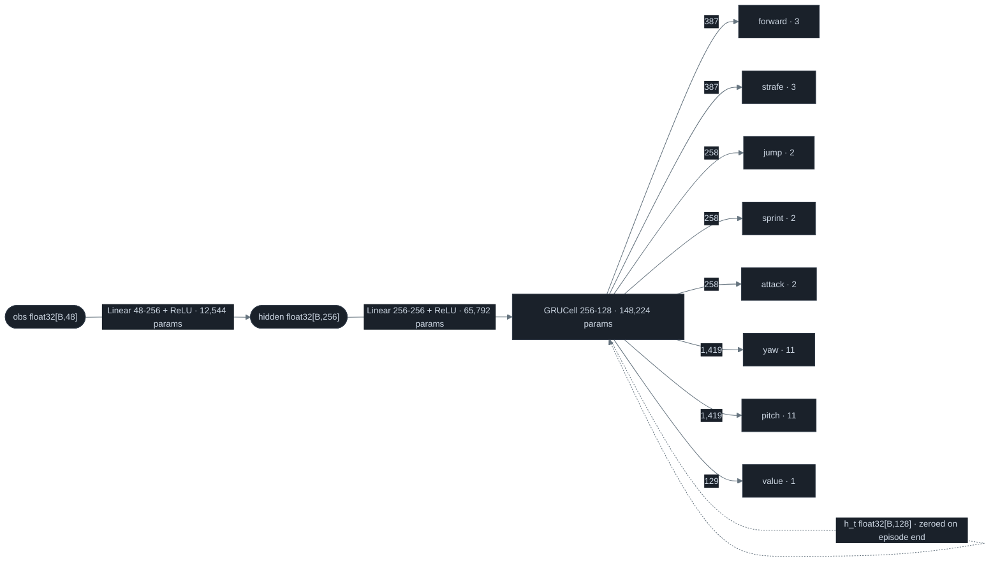
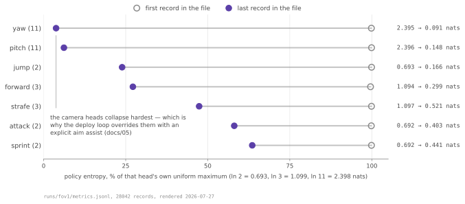
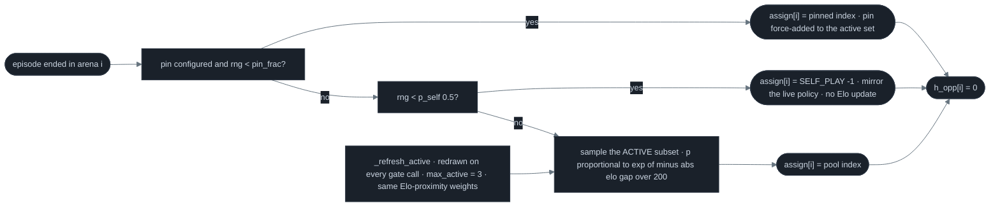
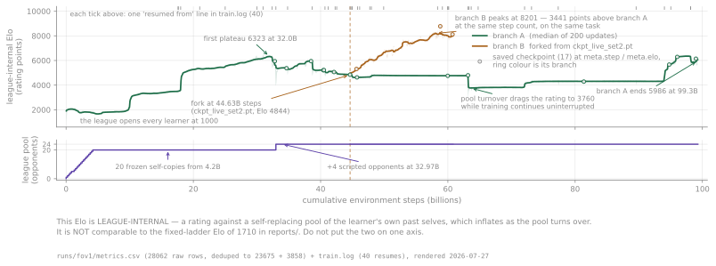
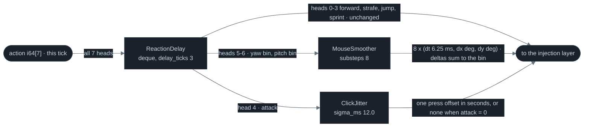
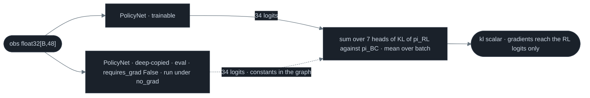

# 04 · Controller — 231,075 parameters, and the league that shaped them

<b>The same seeded duel, fought by three checkpoints from three run directories.</b> Identical spawn in all three panels — policy at (4.61, 2.75) yaw 33.9°, T4-Pro at (0.38, 4.56) yaw 155.9° — and the panel headers carry 64-duel records rather than league Elo, because each run directory rates itself against its own self-replacing pool of past selves: 0-64-0 at 5,242,880 env-steps, 0-64-0 at 83,886,080, 64-0-0 at 34,644,951,040, with mean aim error 44.0° → 27.5° → 8.3°. — <i>DuelVecEnv(1, seed=3, SimConfig()), full-information observations, vs scripted T4-Pro</i> — <code>tools/figures/anim_policy_across_training.py</code> · <i>237 live frames + a 30-frame hold @ 20 fps, one frame per 50 ms tick</i>

A Minecraft tick is 50 ms: the game's simulation step, and the unit every number on this page is denominated in. The controller reads 48 floats and emits 7 integers, twenty times a second, at one fifteenth the size of the sensor that feeds it ([03 · Sensor](03-sensor.md), 3,500,204 parameters).

## The network

<b>PolicyNet, layer by layer, with the parameter count on every edge.</b> Edge labels are weight counts read off the layer shapes in <code>pvpbot/models.py</code>; the dashed self-edge is the GRU state, carried across ticks and re-zeroed wherever an episode ended.

| Block | Shape | Params | Source |
|---|---|---:|---|
| encoder layer 1 | `Linear(48, 256)` | 12,544 | [`pvpbot/models.py:23`](../pvpbot/models.py#L23) |
| encoder layer 2 | `Linear(256, 256)` | 65,792 | [`pvpbot/models.py:24`](../pvpbot/models.py#L24) |
| recurrent core | `GRUCell(256, 128)` — `weight_ih` 384×256, `weight_hh` 384×128, `bias_ih` and `bias_hh` 384 each (three gates × 128) | 148,224 | [`pvpbot/models.py:26`](../pvpbot/models.py#L26) |
| seven action heads | `Linear(128, n)` for n in (3, 3, 2, 2, 2, 11, 11) | 4,386 | [`pvpbot/models.py:27`](../pvpbot/models.py#L27) |
| value head | `Linear(128, 1)` | 129 | [`pvpbot/models.py:30`](../pvpbot/models.py#L30) |
| **total** | 24 tensors in the state dict | **231,075** | `python3 -c "from pvpbot.models import PolicyNet; print(sum(p.numel() for p in PolicyNet().parameters()))"` |

The joint action space is 3·3·2·2·2·11·11 = 8,712 combinations and is never materialised: the heads are conditionally independent given the GRU state, so the network emits 34 logits, samples one index per head, and sums the seven log-probs into a joint log-prob ([`pvpbot/spec.py:17`](../pvpbot/spec.py#L17), [`pvpbot/models.py:53`](../pvpbot/models.py#L53), [`pvpbot/train/ppo.py:84`](../pvpbot/train/ppo.py#L84)), which is the whole reason a 231,075-parameter network can press keys and move a mouse in the same tick. Recurrence then earns its 148,224 parameters on two specific mechanics. A landed hit opens a 10-tick invulnerability window on the victim ("hurt-time") during which a further swing lands only what it deals in excess of the last hit ([`pvpbot/sim/env.py:91`](../pvpbot/sim/env.py#L91), [`pvpbot/sim/env.py:682`](../pvpbot/sim/env.py#L682)); the sim publishes that countdown in obs slot 14, and the `mask_dead_senses` knob ([02 · Deliberate imperfection, by knob](02-physics-engine.md#deliberate-imperfection-by-knob)) pins it to the live adapter's blind default of 0.0, because live that slot is derived from the CNN's hurt-flash channel ([`pvpbot/sim/env.py:832`](../pvpbot/sim/env.py#L832)), which leaves the GRU to count it. And under the `fov_limited_obs` gate from the same table, once the enemy leaves the 120°×90° camera cone its aim-error channels are hard-zeroed and its bearing freezes at the last-seen value with relative velocity decaying ×0.8 per tick ([`pvpbot/sim/env.py:896`](../pvpbot/sim/env.py#L896)), so remembering where it went is the difference between turning toward it and searching.

## What it maximises

| Term | Value | When it fires | Source |
|---|---:|---|---|
| `hit` | 1.0 | a swing that connects *fresh* — outside the victim's 10-tick hurt window; an excess-damage hit inside the window still pushes damage through and earns nothing | [`pvpbot/sim/env.py:197`](../pvpbot/sim/env.py#L197) → [`env.py:734`](../pvpbot/sim/env.py#L734) |
| `hurt` | −1.0 | the exact mirror of the opponent's `hit`: `taken_f = hits_f[:, ::-1]` | [`pvpbot/sim/env.py:198`](../pvpbot/sim/env.py#L198) → [`env.py:734`](../pvpbot/sim/env.py#L734) |
| `win` | 10.0 | terminal tick where the opponent's HP reached 0 and this side's did not | [`pvpbot/sim/env.py:199`](../pvpbot/sim/env.py#L199) → [`env.py:767`](../pvpbot/sim/env.py#L767) |
| `loss` | −10.0 | terminal tick where this side's HP reached 0 and the opponent's did not | [`pvpbot/sim/env.py:200`](../pvpbot/sim/env.py#L200) → [`env.py:767`](../pvpbot/sim/env.py#L767) |
| `aim_coeff` | 0.01 | every tick, as `−0.01·(\|yaw_err\|/180° + \|pitch_err\|/90°)` — the only dense term, bounded at −0.02 per tick | [`pvpbot/sim/env.py:201`](../pvpbot/sim/env.py#L201) → [`env.py:735`](../pvpbot/sim/env.py#L735) |
| `sprint_toggle_coeff` | 0.005 | every tick the sprint head's index differs from the previous tick's | [`pvpbot/sim/env.py:202`](../pvpbot/sim/env.py#L202) → [`env.py:738`](../pvpbot/sim/env.py#L738) |
| `punish_close_bonus` | 0.0 | a hit landed while the opponent is closing faster than `_COMMIT_V` 0.11 stored-velocity units inside the `_COMMIT_LO/HI` 1.8–3.6 m band, on a `_COMMIT_TICKS` 6-tick armed window | [`pvpbot/sim/env.py:209`](../pvpbot/sim/env.py#L209) → [`env.py:741`](../pvpbot/sim/env.py#L741) |
| `punish_swing_bonus` | 0.0 | a hit landed within `_SWING_TICKS` 8 ticks (400 ms) of the opponent's own swing | [`pvpbot/sim/env.py:214`](../pvpbot/sim/env.py#L214) → [`env.py:752`](../pvpbot/sim/env.py#L752) |

A hit is worth 1, a kill is worth 10, and every term is mirrored across the two sides: `taken_f = hits_f[:, ::-1]`, `win` and `loss` built from the same reversed death mask ([`pvpbot/sim/env.py:686`](../pvpbot/sim/env.py#L686), [`pvpbot/sim/env.py:765`](../pvpbot/sim/env.py#L765)), so self-play is exactly zero-sum and no policy can farm reward by cooperating with its own mirror. The dense aim term is a bounded nudge rather than an objective: it tops out at 0.02 per tick with the crosshair a full 180° off and decays toward zero as it converges, so a policy that already aims pays almost nothing for it, against 10 for a kill. Both bait-and-punish shaping bonuses ship at 0.0 and their branches are skipped outright by a `!= 0.0` guard, as are the `--punish-close` / `--punish-swing` flags that would set them ([`pvpbot/train/run.py:519`](../pvpbot/train/run.py#L519), [`pvpbot/train/run.py:540`](../pvpbot/train/run.py#L540)), so the shipping objective is the six live terms above and nothing else.

## One update, as tensor shapes

| Stage | Tensors and shapes | Note | Source |
|---|---|---|---|
| 1 · rollout buffer | `obs (128, 32768, 48)` f32 · 768 MiB · `actions (128, 32768, 7)` i64 · 224 MiB · `logp`/`values`/`rewards`/`dones` `(128, 32768)` · `h_init (8, 32768, 128)` f32 · 128 MiB | time-major NumPy; 8 hidden states per arena, not 128 — one per chunk boundary | [`pvpbot/train/ppo.py:185`](../pvpbot/train/ppo.py#L185) |
| 2 · GAE(λ) | `advantages (128, 32768)`, `returns = adv + values` | `delta_t = r_t + γ·V_{t+1}·(1−d_t) − V_t`; `lastgae = delta + γλ(1−d_t)·lastgae` | [`pvpbot/train/ppo.py:129`](../pvpbot/train/ppo.py#L129) |
| 3 · `_prep` reshape | every `(T, N, …)` → `.view(C=8, L=16, N=32768, …)` | advantages normalised once here, over the whole buffer, not per minibatch | [`pvpbot/train/ppo.py:272`](../pvpbot/train/ppo.py#L272) |
| 4 · flatten to sequences | `S = C·N = 262,144` sequence ids; `c_idx = id // N`, `n_idx = id % N` | PPO shuffles sequences, never individual ticks | [`pvpbot/train/ppo.py:378`](../pvpbot/train/ppo.py#L378) |
| 5 · minibatch | `B = S/8 = 32,768` sequences → `obs (32768, 16, 48)`, `actions (32768, 16, 7)`, `h_init[c_idx, n_idx] (32768, 128)` | = 524,288 transitions per minibatch | [`pvpbot/train/ppo.py:389`](../pvpbot/train/ppo.py#L389) |
| 6 · sequence replay | 16-iteration loop; each step `PolicyNet(obs[:,t], h)` → 7 logit tensors + value + `h`, then `h *= (1 − done[:,t])` | identical masking to the collector at [`run.py:112`](../pvpbot/train/run.py#L112) | [`pvpbot/train/ppo.py:300`](../pvpbot/train/ppo.py#L300) |
| 7 · loss | `pg_loss = mean(max(−A·r, −A·clip(r, 0.8, 1.2)))`; `v_loss = 0.5·mean(max((V−R)², (V_clip−R)²))` × `vf_coef` 0.5; `ent_bonus = ent_coef · Σ_h entropy_h` → backward → `clip_grad_norm_(0.5)` → Adam | 2 epochs × 8 minibatches = 16 gradient steps per 4,194,304 env-steps | [`pvpbot/train/ppo.py:337`](../pvpbot/train/ppo.py#L337) |

```mermaid
%%{init:{'theme':'base','themeVariables':{'background':'#12161c','primaryColor':'#1a212a','primaryTextColor':'#ccd6e2','primaryBorderColor':'#2b3542','lineColor':'#66747f','secondaryColor':'#1a212a','tertiaryColor':'#12161c','textColor':'#ccd6e2','edgeLabelBackground':'#1a212a','fontFamily':'ui-monospace,SFMono-Regular,Menlo,monospace','fontSize':'13px'}}}%%
flowchart LR
  BUF["1 · rollout buffer<br/>time-major, 128 ticks x 32,768 arenas"] -->|"rewards, values, dones f32[128,32768]"| GAE["2 · GAE lambda 0.95"]
  GAE -->|"advantages, returns f32[128,32768]"| PREP
  BUF -->|"obs f32[128,32768,48] · actions i64[128,32768,7] · logp f32[128,32768]"| PREP["3 · _prep view<br/>C=8 chunks x L=16 ticks"]
  PREP -->|"obs f32[8,16,32768,48] · actions i64[8,16,32768,7]"| FLAT["4 · flatten to sequences"]
  FLAT -->|"S = C x N = 262,144 sequence ids, shuffled whole"| MB["5 · minibatch, 8 per epoch"]
  MB -->|"obs f32[32768,16,48] · actions i64[32768,16,7]"| REP["6 · 16-step GRU replay"]
  HINIT(["h_init f32[8,32768,128] · one state per chunk boundary"]) -->|"h_init[c_idx, n_idx] f32[32768,128]"| REP
  REP -->|"34 logits + 1 value per step · 524,288 transitions"| LOSS["7 · pg + 0.5 v − ent"]
  LOSS -->|"clip_grad_norm_ 0.5"| ADAM["Adam lr 3e-4"]
  ADAM -.->|"epoch 2 reshuffles the same buffer · 16 gradient steps per update"| MB
```

<b>One PPO update, as six reshapes.</b> Every edge carries the tensor it moves; the stored GRU state enters from the side rather than along the chain, one per (chunk, arena) pair instead of one per tick, which is what makes a minibatch element a 16-step sequence rather than a transition. — <code>pvpbot/train/ppo.py:272</code>

The one non-obvious idea in that pipeline: a minibatch element is a 16-step **sequence**, not a transition. The buffer stores the GRU hidden state only at chunk boundaries — 8 states per arena instead of 128, a 16× reduction, and the update replays each (chunk, arena) pair forward from that stored state, re-zeroing the state wherever an episode ended, which is exactly what the collector did while gathering the data; the replayed inputs are bit-identical to the collected ones because the buffer stores the already-normalized observations that were fed to the policy ([`pvpbot/train/ppo.py:16`](../pvpbot/train/ppo.py#L16)). Stage 2 is where an auto-resetting env could silently leak reward across episode boundaries, and one term prevents it: `nonterm = 1 - dones[t]` multiplies both the bootstrap value and the recursive carry, so `values[t+1]`, which after a done belongs to a *fresh* episode — never reaches back into the finished one ([`pvpbot/train/ppo.py:150`](../pvpbot/train/ppo.py#L150)).

PPO configuration — 12 rows

| Hyper-parameter | Value | Source |
|---|---:|---|
| learning rate | 3e-4 | [`pvpbot/train/ppo.py:220`](../pvpbot/train/ppo.py#L220) |
| gamma | 0.99 | [`pvpbot/train/ppo.py:221`](../pvpbot/train/ppo.py#L221) |
| GAE lambda | 0.95 | [`pvpbot/train/ppo.py:222`](../pvpbot/train/ppo.py#L222) |
| clip range | 0.2 | [`pvpbot/train/ppo.py:223`](../pvpbot/train/ppo.py#L223) |
| epochs per update | 2 | [`pvpbot/train/ppo.py:224`](../pvpbot/train/ppo.py#L224) |
| minibatches | 8 | [`pvpbot/train/ppo.py:225`](../pvpbot/train/ppo.py#L225) |
| entropy coef | 0.01 | [`pvpbot/train/ppo.py:226`](../pvpbot/train/ppo.py#L226) |
| value coef | 0.5 | [`pvpbot/train/ppo.py:233`](../pvpbot/train/ppo.py#L233) |
| max grad norm | 0.5 | [`pvpbot/train/ppo.py:234`](../pvpbot/train/ppo.py#L234) |
| chunk length (truncated BPTT) | 16 | [`pvpbot/train/ppo.py:235`](../pvpbot/train/ppo.py#L235) |
| rollout length | 128 | [`pvpbot/train/ppo.py:236`](../pvpbot/train/ppo.py#L236) |
| Adam eps | 1e-5 | [`pvpbot/train/ppo.py:239`](../pvpbot/train/ppo.py#L239) |

## Per-head entropy

<b>What the policy actually committed to, head by head.</b> A hollow marker at each head's entropy in the first record of the training metrics stream and a filled marker at the last, expressed as a share of that head's own uniform maximum so heads with 2, 3 and 11 bins compare on one axis — ln 2 = 0.693, ln 3 = 1.099, ln 11 = 2.398 nats. — <i>league self-play run, per-update PPO metrics</i> — <code>tools/figures/fig_entropy_collapse.py</code> · <code>runs/fov1/metrics.jsonl</code> (append log; the figure stamps its own record count)

The entropy bonus is `cfg.ent_coef · Σ_h entropy_h` by default — one scalar, 0.01, on all seven heads, and switches to a per-head vector `Σ_h coef_h · mean_entropy_h` the moment `--ent-coef-move` or `--ent-coef-cam` diverges from `--ent-coef` ([`pvpbot/train/ppo.py:339`](../pvpbot/train/ppo.py#L339), built at [`pvpbot/train/run.py:200`](../pvpbot/train/run.py#L200); both flags default to −1, meaning "use `--ent-coef`", [`run.py:513`](../pvpbot/train/run.py#L513)). Under `--cam-assist` the divergence happens on its own: the camera coefficient falls back to 0.0 rather than to `--ent-coef` ([`pvpbot/train/run.py:202`](../pvpbot/train/run.py#L202)), giving `(0.01, 0.01, 0.01, 0.01, 0.01, 0.0, 0.0)` in head order forward, strafe, jump, sprint, attack, yaw, pitch ([`pvpbot/train/run.py:207`](../pvpbot/train/run.py#L207)). The vector exists because the env sometimes overrides the policy's own choices — `cam_assist` drives the camera heads, `act_hold` requires a movement bin to persist for several ticks before it takes effect, and a head whose output is overridden collects entropy bonus with zero consequence for the dynamics, bleeding max-entropy pressure into the decisions that do matter. Ranked by how little entropy each head keeps, the order is yaw, pitch, jump, forward, strafe, attack, sprint: the two 11-bin camera heads commit hardest, and they are the two the live loop replaces outright with a bounded-rate aim assist, because the training env's own assist sweeps the camera on every unseen tick and a head whose output was never used is not a head worth trusting ([`pvpbot/deploy/loop.py:855`](../pvpbot/deploy/loop.py#L855), [05 · Live harness](05-harness.md)).

per-head entropy at the end of training, head by head

| Head | Bins | Uniform maximum ln(k) (nats) | Entropy at the first logged update (nats) | Source |
|---|---:|---:|---:|---|
| forward | 3 | 1.0986 | 1.094 | `runs/fov1/metrics.jsonl` (record 1, update 1) |
| strafe | 3 | 1.0986 | 1.097 | `runs/fov1/metrics.jsonl` (record 1) |
| jump | 2 | 0.6931 | 0.693 | `runs/fov1/metrics.jsonl` (record 1) |
| sprint | 2 | 0.6931 | 0.692 | `runs/fov1/metrics.jsonl` (record 1) |
| attack | 2 | 0.6931 | 0.692 | `runs/fov1/metrics.jsonl` (record 1) |
| yaw | 11 | 2.3979 | 2.395 | `runs/fov1/metrics.jsonl` (record 1) |
| pitch | 11 | 2.3979 | 2.396 | `runs/fov1/metrics.jsonl` (record 1) |
| **summed** | — | **9.0725** | **9.059** | `2·ln3 + 3·ln2 + 2·ln11`; logged `entropy` field, record 1 |

## The league

<b>How one arena gets its opponent at reset.</b> Three exits and one convergence: the pinned opponent bypasses both self-play and Elo sampling, a mirror draw runs the live policy against itself and produces no rating signal, and everything else is drawn from a subset of at most three concurrently-active pool members — every distinct active opponent costs one extra policy forward per tick. — <code>pvpbot/train/league.py:208</code>

every league parameter

| League parameter | Value | Source |
|---|---:|---|
| `p_self` — probability an arena mirrors the live policy | 0.5 | [`pvpbot/train/league.py:120`](../pvpbot/train/league.py#L120) |
| `elo_k` | 16 | [`pvpbot/train/league.py:121`](../pvpbot/train/league.py#L121) |
| `elo_scale` — softmax temperature on Elo distance | 200 | [`pvpbot/train/league.py:122`](../pvpbot/train/league.py#L122) |
| `max_pool` — frozen self-snapshots retained | 20 | [`pvpbot/train/league.py:123`](../pvpbot/train/league.py#L123) |
| `gate_winrate` | 0.55 | [`pvpbot/train/league.py:124`](../pvpbot/train/league.py#L124) |
| `min_gate_games` | 32 | [`pvpbot/train/league.py:125`](../pvpbot/train/league.py#L125) |
| `initial_elo` | 1000 | [`pvpbot/train/league.py:126`](../pvpbot/train/league.py#L126) |
| `recent_window` — games in the win-rate deque | 512 | [`pvpbot/train/league.py:127`](../pvpbot/train/league.py#L127) |
| `max_active` — pool members allowed to act concurrently | 3 | [`pvpbot/train/league.py:130`](../pvpbot/train/league.py#L130) |
| `--gate-every` — PPO updates between snapshot attempts | 50 | [`pvpbot/train/run.py:552`](../pvpbot/train/run.py#L552), called at [`run.py:454`](../pvpbot/train/run.py#L454) |

Opponents are drawn by a softmax over negative Elo distance to the learner, so the likely draw is an opponent near the learner's own strength ([`pvpbot/train/league.py:182`](../pvpbot/train/league.py#L182)). A snapshot enters the pool through a win-rate gate, and what gets frozen is not only the weights: it is deep-copied into a fresh `PolicyNet`, set to eval with `requires_grad_(False)`, and stored alongside a **copy of the observation normalizer** it was trained behind — an old policy replayed through the drifted current normalizer would be reading inputs it never saw ([`pvpbot/train/league.py:350`](../pvpbot/train/league.py#L350)). Eviction at capacity is lowest-Elo-first over `ckpts[:-1]`, a slice that makes the newest snapshot un-evictable, so a checkpoint added at the learner's current rating cannot be deleted on the next line ([`pvpbot/train/league.py:365`](../pvpbot/train/league.py#L365)). And one asymmetry is deliberate: scripted opponents are driven from `env._obs_ungated[:,1]`, the omniscient view captured before any camera gating with `enemy_visible` forced to 1.0, because they model mineflayer bots reading server-side truth, while checkpoint and mirror opponents read the same camera-gated observation the learner does ([`pvpbot/train/league.py:241`](../pvpbot/train/league.py#L241), [`pvpbot/sim/env.py:859`](../pvpbot/sim/env.py#L859)). The gate is only *consulted* on update 1 and then every `--gate-every` 50 updates ([`pvpbot/train/run.py:454`](../pvpbot/train/run.py#L454)) — one attempt per 209,715,200 env-steps, so even with every attempt clearing the 0.55 win-rate bar, twenty pool slots cannot turn over faster than once per 4,194,304,000 env-steps.

## The curriculum ladder

| Rung | `aim_jitter` (deg) | `cps` | `crit_rate` | `rot_speed` (deg/s) | `hit_reg` | What tightened | Source |
|---:|---:|---:|---:|---:|---:|---|---|
| 1 | 12.0 | 6 | 0.30 | 240 | 0.80 | (start) | [`pvpbot/train/run.py:279`](../pvpbot/train/run.py#L279) |
| 2 | 8.0 | 8 | 0.50 | 360 | 0.80 | opponent | [`pvpbot/train/run.py:280`](../pvpbot/train/run.py#L280) |
| 3 | 8.0 | 8 | 0.50 | 360 | 0.72 | interface | [`pvpbot/train/run.py:281`](../pvpbot/train/run.py#L281) |
| 4 | 5.0 | 9 | 0.70 | 480 | 0.72 | opponent | [`pvpbot/train/run.py:282`](../pvpbot/train/run.py#L282) |
| 5 | 5.0 | 9 | 0.70 | 480 | 0.66 | interface | [`pvpbot/train/run.py:283`](../pvpbot/train/run.py#L283) |
| 6 | 2.5 | 10 | 0.85 | 540 | 0.66 | opponent | [`pvpbot/train/run.py:284`](../pvpbot/train/run.py#L284) |
| 7 | 2.5 | 10 | 0.85 | 540 | 0.61 | interface | [`pvpbot/train/run.py:285`](../pvpbot/train/run.py#L285) |
| 8 | 1.5 | 11 | 1.00 | 600 | 0.61 | opponent — the official hacker bar | [`pvpbot/train/run.py:286`](../pvpbot/train/run.py#L286) |
| 9 | 1.5 | 11 | 1.00 | 600 | 0.61 | hold | [`pvpbot/train/run.py:287`](../pvpbot/train/run.py#L287) |

<b>Nine rungs, one dimension per rung.</b> Every step tightens <i>either</i> the pinned opponent's knobs <i>or</i> the learner's own hit registration, never both. <code>reaction_ticks</code> stays 0 at every rung. — <code>pvpbot/train/run.py:262</code>

The four opponent columns are the pinned scripted bot's own attributes: aim jitter is Gaussian tracking noise on its bounded-rate homing aim, `cps` is clicks per second, `crit_rate` is how often it opens a jump-crit sequence — in 1.8 a swing thrown while airborne and descending deals 1.5× damage, and `rot_speed` is its rotation cap, where 600 deg/s is exactly the ceiling of the 11-bin camera action space at ±30° per 50 ms tick. Rung 8 is the calibrated P4-Hacker configuration itself ([`pvpbot/eval/practice.py:222`](../pvpbot/eval/practice.py#L222)), the top row of [the field](#the-field). `hit_reg` is the odd column out: it is not an opponent property but the probability that the *learner's* own click registers as a hit, masked onto side 0 alone ([`pvpbot/sim/env.py:669`](../pvpbot/sim/env.py#L669)), and 0.61 was re-fit from live measurement — 2.16 hits per in-range-second live against 3.54 sim-raw on the same estimator ([`pvpbot/train/run.py:275`](../pvpbot/train/run.py#L275)). The ladder advances every 20 updates once at least 2,000 games against the pin have accumulated and the win rate against it clears `--pin-adv-wr`, default 0.35 ([`pvpbot/train/run.py:414`](../pvpbot/train/run.py#L414)).

the pinned P4-Hacker attributes and their randomisation draws

| Pinned attribute | P4-Hacker | `--pin-randomize` draw | Source |
|---|---:|---|---|
| `aim_jitter_deg` | 1.5 | U(1.0, 4.0) | [`pvpbot/train/run.py:295`](../pvpbot/train/run.py#L295) |
| `cps` | 11.0 | U(9.0, 12.0) | [`pvpbot/train/run.py:296`](../pvpbot/train/run.py#L296) |
| `rot_speed_dps` | 600.0 | U(450.0, 750.0) | [`pvpbot/train/run.py:297`](../pvpbot/train/run.py#L297) |
| `crit_rate` | 1.00 | U(0.8, 1.0) | [`pvpbot/train/run.py:298`](../pvpbot/train/run.py#L298) |
| `wtap_rate` | 1.00 | U(0.8, 1.0) | [`pvpbot/train/run.py:299`](../pvpbot/train/run.py#L299) |
| `strafe_rate` | 1.00 | U(0.8, 1.0) | [`pvpbot/train/run.py:300`](../pvpbot/train/run.py#L300) |
| `reaction_ticks` | 0 | 0 or 1, drawn uniformly | [`pvpbot/train/run.py:301`](../pvpbot/train/run.py#L301) |
| `engage_lo` (m) | 2.0 | U(1.8, 2.2) | [`pvpbot/train/run.py:302`](../pvpbot/train/run.py#L302) |
| `engage_hi` (m) | 2.8 | U(2.5, 3.1) | [`pvpbot/train/run.py:303`](../pvpbot/train/run.py#L303) |
| `chase_dist` (m) | 3.2 | U(3.0, 3.6) | [`pvpbot/train/run.py:304`](../pvpbot/train/run.py#L304) |
| `hurt_timed_swing` | on | on with probability 0.7 | [`pvpbot/train/run.py:305`](../pvpbot/train/run.py#L305) |

<b>Eleven attributes redrawn on the pin, against the calibrated bar they bracket.</b> Every range straddles the P4-Hacker value in both directions, on a dedicated `default_rng(seed + 777)` stream so the domain draw is reproducible and independent of the env's own randomness. — <code>pvpbot/train/run.py:289</code>

Under `--pin-randomize` the summit rung is not one bot but a family: `_randomize_pin` ([`pvpbot/train/run.py:291`](../pvpbot/train/run.py#L291)) redraws the pinned agent every 20 updates ([`pvpbot/train/run.py:403`](../pvpbot/train/run.py#L403)) from `aim_jitter` U(1.0, 4.0)°, `cps` U(9, 12), `rot_speed` U(450, 750)°/s, and `crit_rate`, `wtap_rate` and `strafe_rate` each U(0.8, 1.0): brackets that straddle the calibrated P4 bar in both directions, deliberately including rotation caps above the 600 °/s ceiling the learner's own camera head can reach. If the flag is set and the pin cannot be resolved in the pool, the run refuses to start rather than silently training against a fixed target ([`pvpbot/train/run.py:337`](../pvpbot/train/run.py#L337)).

## The scale of the run

<b>The self-play run, restarts and all.</b> League-internal Elo against cumulative environment steps for both branches, with every "resumed from" line in the training log drawn as a tick along the top edge and pool size below rising to 20 frozen self-copies plus 4 scripted opponents; the league opens every learner at 1000 and this rating is <i>not</i> the fixed-field ladder Elo further down the page. — <i>league self-play, append-mode metrics log</i> — <code>tools/figures/fig_league_curve.py</code> · <code>runs/fov1/metrics.csv</code> + <code>train.log</code>

| Quantity | Value | Source |
|---|---:|---|
| env-steps per PPO update | 4,194,304 | `rollout_len` 128 × 32,768 arenas; `step`/`update` in `runs/fov1/metrics.csv` is exactly this |
| PPO updates, main branch | 23,675 | `runs/fov1/metrics.csv`, branch A after keeping the last row per `update` |
| cumulative env-steps, main branch | 99,300,147,200 | `runs/fov1/metrics.csv`, final `step` of branch A |
| median throughput | 296,159 env-steps/s | median of `steps_per_sec` over branch A |
| peak throughput | 403,886 env-steps/s | max of `steps_per_sec` over branch A |
| implied wall clock | 90.9 h | `Σ 4,194,304 / steps_per_sec` over branch A |

Those are 23,675 updates × 16 gradient steps = 378,800 optimizer steps to move 231,075 parameters. The CSV is opened in append mode by every resumed session ([`pvpbot/train/run.py:238`](../pvpbot/train/run.py#L238)), so the file is a log of several lineages rather than one series, and the figure above splits it at the fork, dedupes each branch and stamps its own row counts. The Elo on that curve is a league-internal rating: it moves only against pool opponents, mirror self-play games contribute nothing ([`pvpbot/train/league.py:308`](../pvpbot/train/league.py#L308)), and the gate keeps injecting fresh snapshots at the learner's current rating, so the scale drifts as the pool turns over — a different quantity from the fixed-field ladder Elo at the bottom of this page, and the two never belong on one axis.

## The human prior, as components

| Filter | Mechanism | Setting | Source |
|---|---|---|---|
| `ReactionDelay` | FIFO ring buffer; `step(a_t)` returns `a_{t−3}`, emitting the idle action `[1,1,0,0,0,5,5]` until the buffer fills | `delay_ticks` 3 = 150 ms at 20 tps | [`pvpbot/bc/humanize.py:41`](../pvpbot/bc/humanize.py#L41) |
| `MouseSmoother` | one tick's binned camera delta expanded along the minimum-jerk position profile `s(u) = 10u³ − 15u⁴ + 6u⁵`, sampled at uniform time slices | `substeps` 8 = one micro-move every 6.25 ms | [`pvpbot/bc/humanize.py:97`](../pvpbot/bc/humanize.py#L97) |
| `ClickJitter` | half-normal `abs(N(0, σ))` seconds into the tick — a human is late relative to the decision instant, never early | `sigma_ms` 12.0, clipped at 0.95 of a tick | [`pvpbot/bc/humanize.py:132`](../pvpbot/bc/humanize.py#L132) |

<b>Three standalone filters, each with a measured transfer function.</b> All three are classes, not module-level entry points; the deploy loop carries the socket for them — <code>_resolve_humanizer</code> probes <code>pvpbot.bc.humanize</code> for <code>humanize_action</code>, <code>humanize</code> or <code>apply</code> and falls through to identity when none is exported, which is what it does today, so the live loop injects the policy's own action unfiltered. — <code>pvpbot/deploy/loop.py:208</code> · <code>python3 -c "from pvpbot.deploy.loop import _resolve_humanizer; print(_resolve_humanizer()['source'])"</code> → <code>identity</code>

<b>The three filters and the heads each one owns, in the order the module composes them.</b> <code>ReactionDelay</code> carries all seven and emits the idle action while its buffer fills; <code>MouseSmoother</code> expands only the two camera bins into sub-tick micro-moves; <code>ClickJitter</code> moves only the attack press inside its own tick; the four movement heads pass through untouched. — <code>pvpbot/bc/humanize.py:1</code>

the reaction-delay substeps, millisecond by millisecond

| Substep | Window (ms) | Fraction of the tick's delta | Delivered on a +15°/tick turn (deg) | Cumulative (deg) | × slowest slice | Source |
|---:|---:|---:|---:|---:|---:|---|
| 1 | 0.00–6.25 | 0.01605 | 0.24 | 0.24 | 1.00 | [`pvpbot/bc/humanize.py:97`](../pvpbot/bc/humanize.py#L97) |
| 2 | 6.25–12.50 | 0.08746 | 1.31 | 1.55 | 5.45 | [`pvpbot/bc/humanize.py:97`](../pvpbot/bc/humanize.py#L97) |
| 3 | 12.50–18.75 | 0.17169 | 2.58 | 4.13 | 10.70 | [`pvpbot/bc/humanize.py:97`](../pvpbot/bc/humanize.py#L97) |
| 4 | 18.75–25.00 | 0.22479 | 3.37 | 7.50 | 14.00 | [`pvpbot/bc/humanize.py:97`](../pvpbot/bc/humanize.py#L97) |
| 5 | 25.00–31.25 | 0.22479 | 3.37 | 10.87 | 14.00 | [`pvpbot/bc/humanize.py:97`](../pvpbot/bc/humanize.py#L97) |
| 6 | 31.25–37.50 | 0.17169 | 2.58 | 13.45 | 10.70 | [`pvpbot/bc/humanize.py:97`](../pvpbot/bc/humanize.py#L97) |
| 7 | 37.50–43.75 | 0.08746 | 1.31 | 14.76 | 5.45 | [`pvpbot/bc/humanize.py:97`](../pvpbot/bc/humanize.py#L97) |
| 8 | 43.75–50.00 | 0.01605 | 0.24 | 15.00 | 1.00 | [`pvpbot/bc/humanize.py:97`](../pvpbot/bc/humanize.py#L97) |

<b>One commanded +15°/tick yaw turn, as the eight micro-moves that carry it.</b> Minimum jerk means zero velocity and zero acceleration at both ends, so the opening and closing 6.25 ms slices each deliver 0.24° against 3.37° across the middle — 14.00× between the slowest and fastest slice — and the eight fractions sum to exactly 1.0, landing the cumulative on 15.00° at the tick boundary. — <i>deterministic, no randomness involved</i> — <code>python3 -c "from pvpbot.bc.humanize import MouseSmoother; print(MouseSmoother().smooth_degrees(15.0, 0.0))"</code>

ClickJitter press offsets

| `ClickJitter` press offset | ms | Source |
|---|---:|---|
| σ, the `sigma_ms` default | 12.00 | [`pvpbot/bc/humanize.py:132`](../pvpbot/bc/humanize.py#L132) |
| mean | 9.61 | [`pvpbot/bc/humanize.py:152`](../pvpbot/bc/humanize.py#L152) |
| p50 | 8.16 | [`pvpbot/bc/humanize.py:152`](../pvpbot/bc/humanize.py#L152) |
| p90 | 19.47 | [`pvpbot/bc/humanize.py:152`](../pvpbot/bc/humanize.py#L152) |
| p95 | 23.12 | [`pvpbot/bc/humanize.py:152`](../pvpbot/bc/humanize.py#L152) |
| largest of the 2,000 draws | 46.79 | [`pvpbot/bc/humanize.py:152`](../pvpbot/bc/humanize.py#L152) |
| clip ceiling, 0.95 of a 50 ms tick | 47.50 | [`pvpbot/bc/humanize.py:154`](../pvpbot/bc/humanize.py#L154) |

<b>Where inside its own tick a press actually lands.</b> Half-normal, so the distribution is one-sided by construction — the press is never early, the median sits 8.16 ms into the tick, and the heaviest of 2,000 draws stops 0.71 ms short of the 47.50 ms ceiling that keeps every press inside the tick that decided it. — <i>2,000 draws, seed 0</i> — <code>python3 -c "import numpy as np; from pvpbot.bc.humanize import ClickJitter; c=ClickJitter(seed=0); d=np.array([c.offset(1) for _ in range(2000)])*1e3; print(d.mean(), np.percentile(d,[50,90,95]), d.max())"</code>

A recording is one 48-float observation paired with one 7-integer action per tick, written pickle-free with validation at write time, so a malformed frame fails when it is recorded rather than surfacing as a NaN mid-training ([`pvpbot/bc/recording.py:137`](../pvpbot/bc/recording.py#L137)). Sword-PvP labels are savagely skewed, so the loss uses per-head inverse-frequency class weights `w_c = N / (K · count_c)` — a construction satisfying `Σ_c w_c · count_c = N`, which leaves the overall loss scale unchanged while boosting rare classes in proportion to their rarity; on generated demos that gives attack=1 a weight of 7.14 against 0.54 for attack=0, and jump=1 a weight of 24.32 ([`pvpbot/bc/dataset.py:77`](../pvpbot/bc/dataset.py#L77), reproduced over 16 demos / 3,840 ticks). The clone is then scored by macro-F1 against an explicit majority-class baseline, because a policy collapsed to "hold W, never click" scores about 92% accuracy on the attack head and roughly 0.48 macro-F1 — one of those two numbers tells you it is useless ([`pvpbot/bc/train_bc.py:9`](../pvpbot/bc/train_bc.py#L9), [`pvpbot/bc/train_bc.py:13`](../pvpbot/bc/train_bc.py#L13), implementation at [`pvpbot/bc/train_bc.py:57`](../pvpbot/bc/train_bc.py#L57)).

<b>The KL-to-prior term, as a graph.</b> Both networks are the same <code>PolicyNet</code> class — which is what makes a behaviour-cloned checkpoint and an RL checkpoint byte-compatible — and only the trainable branch carries gradient. — <code>pvpbot/bc/kl.py:69</code>

The direction is `KL(π_RL ‖ π_BC)`, mode-seeking by choice: it lets the RL policy commit to one human-plausible action rather than smearing mass over everything the prior tolerates, and it stays finite where the prior is numerically near-zero ([`pvpbot/bc/kl.py:39`](../pvpbot/bc/kl.py#L39)). A behaviour-cloned checkpoint loaded against its own logits scores KL = 0 to within 1e-6, and the module carries seven tests of its own ([`tests/test_bc_train.py:93`](../tests/test_bc_train.py#L93), [`tests/test_bc_kl.py`](../tests/test_bc_kl.py)). `KLPriorLoss` is self-contained by construction: it imports `pvpbot.models` and `pvpbot.spec` and never `pvpbot.train`, so the trainer branch can pick it up without a cycle ([`pvpbot/bc/kl.py:5`](../pvpbot/bc/kl.py#L5)), and it slots in as `loss = ppo_loss + kl_coef · kl` ([`pvpbot/bc/kl.py:21`](../pvpbot/bc/kl.py#L21)). The shipping trainer does not import it: [`pvpbot/train/ppo.py:343`](../pvpbot/train/ppo.py#L343) is exactly `loss = pg_loss + vf_coef·v_loss − ent_bonus`, `kl_coef` appears nowhere in the repo outside that docstring, and the 99,300,147,200-step run on this page is pure self-play PPO with no prior anchor.

## The field

| Bot | In one clause | Aim: rot cap (deg/s) · lag · σ (deg) | Swing rule | crit / w-tap / strafe | Source |
|---|---|---|---|---|---|
| **T0-Idle** | emits a literal no-op every tick — the floor of the ladder | — | never swings | — | [`pvpbot/eval/scripted.py:130`](../pvpbot/eval/scripted.py#L130) |
| **T1-Aimbot** | exact aim from a standstill, so it only ever fights what walks into it | 600 · none · 0 | in reach, one swing per 7 ticks = 2.9 cps | — | [`pvpbot/eval/scripted.py:144`](../pvpbot/eval/scripted.py#L144) |
| **T2-Chaser** | sprints straight down its own crosshair and spam-clicks, blind to the hurt window | 600 · none · 0 | in reach, one per 4 ticks = 5.0 cps | — | [`pvpbot/eval/scripted.py:177`](../pvpbot/eval/scripted.py#L177) |
| **T3-Strafer** | closes to 3.5 m and circle-strafes, flipping direction every 15–35 ticks | 600 · EMA α 0.55 · 4.0 | in reach with ≤ 2.1 ticks of the victim's window left, one per 2–3 ticks = 8.0 cps on average, 10% flubbed outright | — / — / always inside 3.5 m | [`pvpbot/eval/scripted.py:212`](../pvpbot/eval/scripted.py#L212) |
| **T4-Pro** | T3's movement plus hurt-expiry timing, w-taps, crit hops and spacing while in its own hurt-time | 600 · EMA α 0.85 · 1.5 | every tick the victim's hurt timer reads 0 and it is in reach — no cooldown at all | hop p 0.5 under 2.0 m mid-window / 2-tick release / always inside 3.5 m | [`pvpbot/eval/scripted.py:290`](../pvpbot/eval/scripted.py#L290) |
| **P1-Easy** | the PracticeBotPvP *Easy* row: slow reactions, low CPS, rare techniques | 120 · 6 ticks · 4.0 | crosshair on the hitbox and inside 3.05 m, one per 5 ticks = 4.0 cps | 0.10 / 0.10 / 0.30 | [`pvpbot/eval/practice.py:184`](../pvpbot/eval/practice.py#L184) |
| **P2-Medium** | the *Medium* row, which is also the base class's own default parameterisation | 240 · 3 ticks · 2.5 | same gate, one per 2 ticks = 10.0 cps | 0.40 / 0.50 / 0.60 | [`pvpbot/eval/practice.py:195`](../pvpbot/eval/practice.py#L195) |
| **P3-Hard** | the *Hard* row: fast reactions, high CPS, near-constant techniques | 480 · 1 tick · 1.5 | same gate, one per 2 ticks = 10.0 cps | 0.80 / 0.90 / 0.85 | [`pvpbot/eval/practice.py:201`](../pvpbot/eval/practice.py#L201) |
| **P4-Hacker** | the *Hacker* row, recalibrated against the real thing, holding a 2.0–2.8 m engage band | 600 · 0 ticks · 1.5 | same gate, and only once the victim's hurt window has run out; one per 2 ticks = 10.0 cps | 1.00 / 1.00 / 1.00 | [`pvpbot/eval/practice.py:212`](../pvpbot/eval/practice.py#L212) |

<b>The nine contestants, as parameter rows.</b> Five hand-written tiers separated along three axes — aim, movement, click cadence — and four ports of the published PracticeBotPvP difficulty table sharing one parameterised engine; all nine are vectorized NumPy reading the 48-float observation vector and emitting the same seven action heads as the learner. — <code>pvpbot/eval/scripted.py:69</code> · <code>pvpbot/eval/practice.py:51</code>

The two families model reaction differently, and it shows in the aim column. The T-tiers have no rotation cap of their own: they snap the camera to the nearest of the eleven mu-law bins each tick, so their ceiling is the action space's own ±30° per 50 ms tick = 600 deg/s ([`pvpbot/eval/scripted.py:63`](../pvpbot/eval/scripted.py#L63)), and T3 and T4 model human lag as an EMA tracker over a noisy error rather than a delay line. The four practice ports instead run a literal `reaction_ticks` ring buffer into a bounded-rate wurst-style aim loop, rotating at most `rot_speed_dps / 20` degrees per tick toward an error read that many ticks late ([`pvpbot/eval/practice.py:105`](../pvpbot/eval/practice.py#L105), [`pvpbot/eval/practice.py:115`](../pvpbot/eval/practice.py#L115)). They also gate their clicks on geometry rather than on a reach scalar: the crosshair must sit inside `atan(0.35/d)` horizontally and `atan(1.05/d)` vertically of the target's box, 6.65° and 19.29° at 3 m, and it is tested against the *current* error, not the delayed one ([`pvpbot/eval/practice.py:156`](../pvpbot/eval/practice.py#L156)). One quantisation falls out of that engine: `cps` becomes an integer tick cooldown, `max(round(20/cps), 1)`, so P2's 8, P3's 12 and P4's 11 all land on the same 2-tick floor of 10 clicks per second ([`pvpbot/eval/practice.py:167`](../pvpbot/eval/practice.py#L167)).

## The ladder

<b>The ten-way round robin, scored by two independent raters.</b> Elo bars with each contestant's W-L-D printed at the bar end against the 1000 seed rating, and mean hits landed versus mean hits taken per duel with marker area scaled by mean combo length — the learned checkpoint takes 1612 at 514-5-21 on 12.22 hits landed against 3.16 taken, average combo 5.52. — <i>real-physics sim, 60 duels per pair, seed 0, default SimConfig, re-run 2026-07-28</i> — <code>tools/figures/fig_ladder_standings.py</code> · <code>docs/assets/data/ladder-report.json</code>

Against [the full field of nine](#the-field) — five hand-written scripted tiers, T0-Idle through T4-Pro, and the four PracticeBotPvP ports, P1-Easy through P4-Hacker — the learned checkpoint finishes first at 514-5-21 in the sim, beating every contestant in the field including both immobile tiers. Second place is P3-Hard at Elo 1235 on 11.46 hits landed against 8.26 taken (`docs/assets/data/ladder-report.json`).

Full 10×10 win matrix — 10 rows, wins-losses-draws, 60 duels per pair

| vs | ckpt 45.3B | P3-Hard | P4-Hacker | T2-Chaser | T4-Pro | T3-Strafer | T1-Aimbot | P1-Easy | P2-Medium | T0-Idle |
|---|---|---|---|---|---|---|---|---|---|---|
| **ckpt 45.3B** | -- | 59-1-0 | 58-2-0 | 60-0-0 | 58-2-0 | 60-0-0 | 39-0-21 | 60-0-0 | 60-0-0 | 60-0-0 |
| **P3-Hard** | 1-59-0 | -- | 3-4-53 | 9-7-44 | 36-4-20 | 19-4-37 | 52-1-7 | 60-0-0 | 60-0-0 | 60-0-0 |
| **P4-Hacker** | 2-58-0 | 4-3-53 | -- | 11-4-45 | 41-2-17 | 13-7-40 | 52-1-7 | 60-0-0 | 60-0-0 | 60-0-0 |
| **T2-Chaser** | 0-60-0 | 7-9-44 | 4-11-45 | -- | 26-3-31 | 10-5-45 | 3-3-54 | 60-0-0 | 60-0-0 | 60-0-0 |
| **T4-Pro** | 2-58-0 | 4-36-20 | 2-41-17 | 3-26-31 | -- | 31-5-24 | 8-2-50 | 60-0-0 | 60-0-0 | 60-0-0 |
| **T3-Strafer** | 0-60-0 | 4-19-37 | 7-13-40 | 5-10-45 | 5-31-24 | -- | 2-34-24 | 60-0-0 | 60-0-0 | 60-0-0 |
| **T1-Aimbot** | 0-39-21 | 1-52-7 | 1-52-7 | 3-3-54 | 2-8-50 | 34-2-24 | -- | 60-0-0 | 60-0-0 | 0-0-60 |
| **P1-Easy** | 0-60-0 | 0-60-0 | 0-60-0 | 0-60-0 | 0-60-0 | 0-60-0 | 0-60-0 | -- | 50-10-0 | 60-0-0 |
| **P2-Medium** | 0-60-0 | 0-60-0 | 0-60-0 | 0-60-0 | 0-60-0 | 0-60-0 | 0-60-0 | 10-50-0 | -- | 60-0-0 |
| **T0-Idle** | 0-60-0 | 0-60-0 | 0-60-0 | 0-60-0 | 0-60-0 | 0-60-0 | 0-0-60 | 0-60-0 | 0-60-0 | -- |

Source: `docs/assets/data/ladder-report.json`: one learned checkpoint against the nine scripted contestants, `matches_per_pair` 60, `seed` 0, written by `python3 -m pvpbot.eval.ladder` ([`pvpbot/eval/ladder.py:243`](../pvpbot/eval/ladder.py#L243)). A duel that reaches the 1,200-tick cap is recorded as a draw ([`pvpbot/eval/arena.py:314`](../pvpbot/eval/arena.py#L314)), which is why the evenly-matched middle of the field is mostly draws.

---

**Next → [05 · Live harness](05-harness.md)** — how those seven integers become real mouse deltas and keystrokes on a real macOS screen, inside a 50 ms tick.
