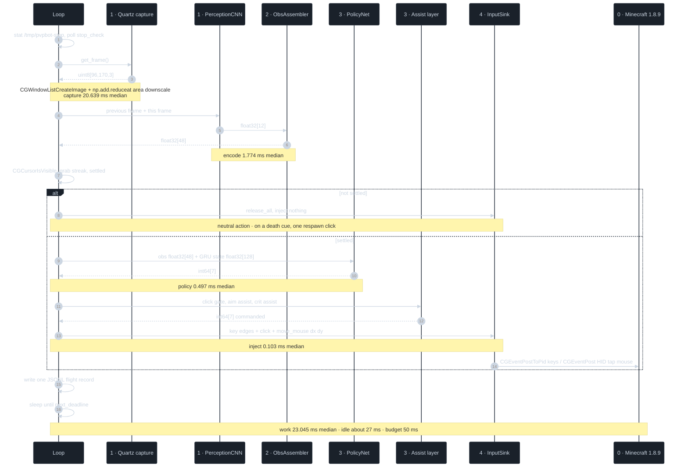
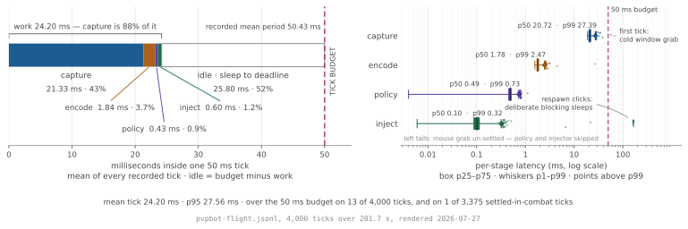
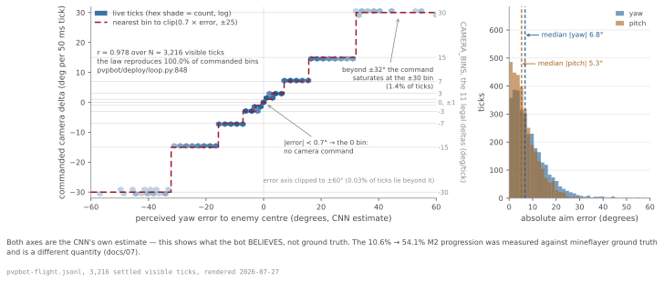
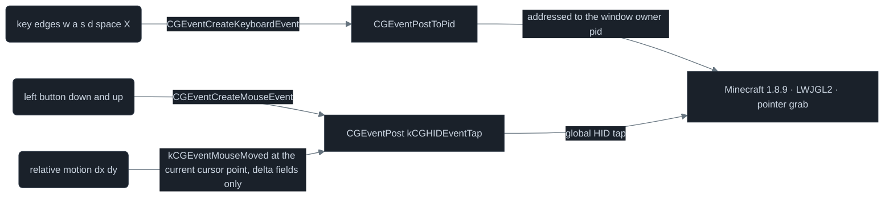
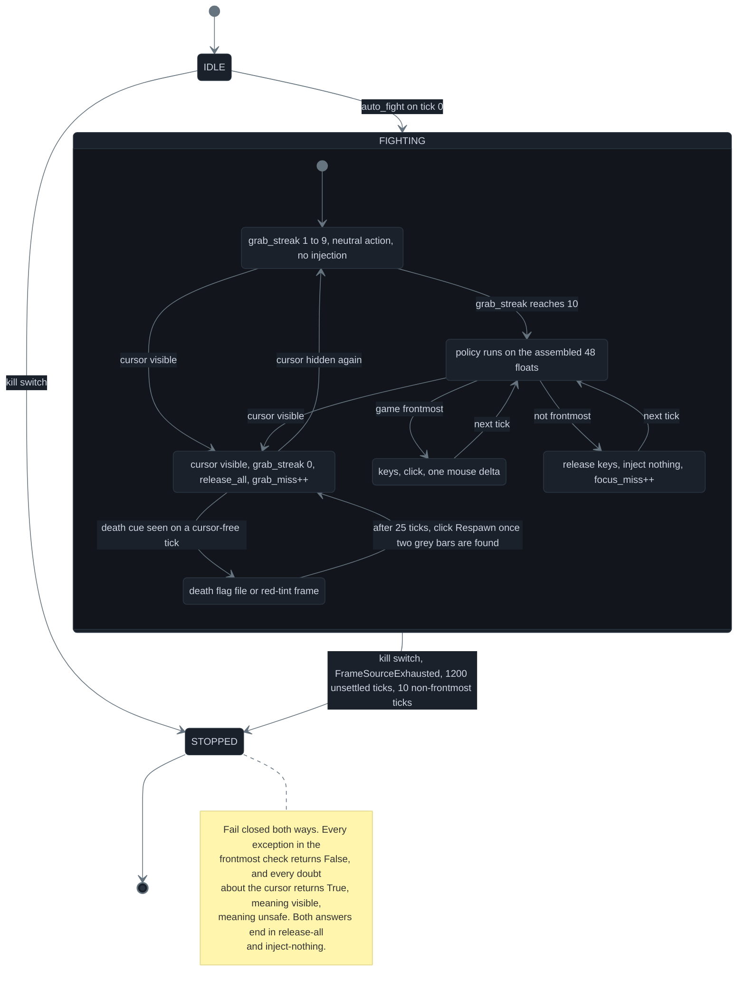

# 05 · Live harness — seven integers to a real mouse, inside 50 ms


<sub><b>The loop instrumented at 20 Hz — one GIF frame per logged tick.</b> Session A is a dry run: <code>MockFrameSource.noise</code> feeds the CNN uniform-noise frames and a <code>MockInputSink</code> swallows the output, so the CNN and the policy do real work while capture and injection are stubs. The CNN calls the enemy visible on 33 of those 100 noise frames; on the others the radar blip turns amber and sweeps an arc of frozen range while the camera keeps turning, and the whole capture → CNN → policy → inject chain costs a median 2.542 ms of the 50 ms tick — 5.08% of the budget, tick 0's 30.214 ms cold start excluded. — <i>dry run on synthetic frames; session A, 100 ticks / 4.951 s</i> — <code>pvpbot-flight.jsonl</code> (100 rows, gitignored) · <i>100 frames @ 20 fps</i></sub>

[`pvpbot/deploy/`](../pvpbot/deploy/) is the machine's I/O board: 1,010 lines in [`loop.py`](../pvpbot/deploy/loop.py) plus capture and injection backends that take a screenshot of a real Minecraft 1.8.9 window and press real keys. No game-side mod, no API, no memory reads, no packet injection: pixels in, HID events out. A *tick* is Minecraft's 50 ms simulation step; `TICK_RATE = 20` ([`pvpbot/spec.py:7`](../pvpbot/spec.py#L7)) sets both the loop's period and the units of everything the policy emits, so the harness runs at exactly the cadence the policy was trained on. *Reach* is the 3.0 blocks a 1.8 sword swing can cross, measured eye to the nearest point of the target's box ([`pvpbot/sim/env.py:81`](../pvpbot/sim/env.py#L81)); a *critical hit* is a swing thrown while airborne and falling, worth 1.5× damage ([`pvpbot/sim/env.py:90`](../pvpbot/sim/env.py#L90)).

## One tick, end to end



<sub><b>One live tick, stage by stage.</b> Stage badges match the rest of the docset — 0 screen, 1 sensor, 2 adapter, 3 controller, 4 injection — and the arrow notes carry session-B medians over 3,375 settled ticks. The assist layer's three overrides are CLI flags — <code>--aim-assist</code> defaults to 1, <code>--click-discipline</code> and <code>--crit-assist</code> to 0 (<code>pvpbot/deploy/run.py:107</code>); each is written out predicate by predicate in <a href="#the-three-overrides">The three overrides</a>. — <i>live, through the pixel pipeline; session B, 4,000 logged rows / 3,375 settled / 168.8 s of settled ticks</i> — <code>docs/assets/data/live-pixels-tick.json</code></sub>

| Stage | What happens in it | Session A, dry run (ms) | Session B, live (ms) | Source |
|---|---|---:|---:|---|
| capture | `CGWindowListCreateImage`, BGRA copy, area downscale to (96,170,3) | 0.093 | 20.639 | `pvpbot/deploy/capture.py:284` |
| encode | PerceptionCNN forward + `ObsAssembler` → 48 floats | 1.917 | 1.774 | `pvpbot/deploy/loop.py:752` |
| policy | `PolicyNet.act`, GRU state carried across ticks | 0.493 | 0.497 | `pvpbot/deploy/loop.py:795` |
| inject | key edges, click, one relative mouse move | 0.021 | 0.103 | `pvpbot/deploy/loop.py:940` |
| **tick** | **t4 − t0, the four stages summed** | **2.542** | **23.045** | `pvpbot/deploy/loop.py:950` |

<sub>Session A is the 100-tick dry run behind the GIF above — 4.951 s, mock frame source and mock sink, so its capture and inject columns price the stubs rather than the OS; its medians are taken over the 99 ticks after tick 0's 30.214 ms cold start (<code>docs/assets/data/live-cockpit.json</code>). Session B is the live paired frames-plus-telemetry run — 4,000 logged rows, 3,375 settled, 168.8 s of settled ticks across a 201.7 s span; its medians are taken over the settled ticks (<code>docs/assets/data/live-pixels-tick.json</code>). The two are never averaged together.</sub>

Five `clock()` reads split every tick into those four stages, and a warning fires whenever the sum passes `TICK_BUDGET_MS = 50` ([`loop.py:959`](../pvpbot/deploy/loop.py#L959)). In session A the median tick is 5.08% of that budget, with zero overruns across all 100 ticks. In session B the median tick is 46.1% of it. Both `clock` and `sleep` are constructor-injected ([`loop.py:499`](../pvpbot/deploy/loop.py#L499)), which is why 45 deploy tests (including full 40-tick runs with pacing assertions) finish in 0.99 s on a fake clock (`python3 -m pytest tests/test_deploy_loop.py tests/test_deploy_capture.py tests/test_deploy_input.py -q`).

## From window pixels to 48,960 bytes



<sub><b>Where one live tick goes, per stage.</b> Left, the mean composition of a tick laid against the 50 ms budget with the idle sleep to the next deadline drawn hollow; right, every recorded tick's per-stage latency on a log axis — box p25–p75, whiskers p1–p99, white rule p50, points beyond p99 — which is the only way inject and capture fit on one axis, and the left tails on policy and inject are the unsettled ticks, on which neither stage runs at all. — <i>live, through the pixel pipeline; session B, all 4,000 logged ticks, settled and unsettled — the stage table above is the 3,375 settled ticks only</i> — <code>tools/figures/fig_live_latency.py</code></sub>

The game window is resolved exactly **once**, at construction, by substring-matching `kCGWindowName` and `kCGWindowOwnerName` ([`capture.py:242`](../pvpbot/deploy/capture.py#L242)); every tick after that calls `CGWindowListCreateImage` on that fixed window id, copies the BGRA bytes out of the `CGDataProvider`, strides past the row padding (`bytesPerRow` is not `width * 4`) and reindexes `[..., [2,1,0]]` to RGB ([`capture.py:256`](../pvpbot/deploy/capture.py#L256)). `downscale_area` then reduces each axis with `np.add.reduceat` over surjective bucket offsets: an exact block mean when the ratio is integral, no PIL, no OpenCV, no interpolation kernel ([`capture.py:66`](../pvpbot/deploy/capture.py#L66)), and returns `(96, 170, 3)` uint8.

| Quantity | Value | Source |
|---|---:|---|
| Window captured (this machine) | 854 × 508 pt | `pvpbot/deploy/SETUP.md:85` |
| Raw BGRA bytes per grab | 1,735,328 | `854 * 508 * 4` |
| Frame contract, `FRAME_SHAPE` | (3, 96, 170) uint8 | `pvpbot/spec.py:10` |
| Bytes per frame delivered | 48,960 | `3 * 96 * 170` |
| Compression across the stage | 35.4 × | `1735328 / 48960` |

That 48,960-byte frame is the only thing the rest of the machine ever sees of the screen; the loop hands the previous frame and the current one to the sensor as a pair ([`loop.py:747`](../pvpbot/deploy/loop.py#L747)) and the CNN turns them into twelve floats: see [03 · Sensor](03-sensor.md). If the window vanishes mid-run, `CGWindowListCreateImage` returns `None` and the source raises `FrameSourceExhausted`, which ends the session outright rather than re-matching by title ([`capture.py:265`](../pvpbot/deploy/capture.py#L265)): a substring re-match is how a harness silently latches onto a different window and keeps injecting.

## Degrees to pixels

<details>
<summary>degrees to pixels, transform by transform</summary>

| # | Transform | Yaw (head 5 = bin 9) | Pitch (head 6 = bin 7) | Source |
|---:|---|---:|---:|---|
| 1 | policy head → bin index | 9 | 7 | `docs/assets/data/live-pixels-tick.json` |
| 2 | `CAMERA_BINS[bin]` | +15.0 deg/tick | +3.0 deg/tick | `pvpbot/spec.py:30` |
| 3 | × px_per_degree (measured 6.667) | +100.005 px | +20.001 px | `pvpbot/deploy/input_inject.py:100` |
| 4 | pitch clamp, ±55 deg on `est_pitch` | — | ×1.0 (clamp inert here) | `pvpbot/deploy/loop.py:360` |
| 5 | axis flip `dy = -dy` | — | −20.001 px | `pvpbot/deploy/loop.py:372` |
| 6 | sub-pixel accumulator | +100 px | −20 px | `pvpbot/deploy/input_inject.py:124` |
| 7 | `kCGEventMouseMoved`, delta fields only | dx = +100 | dy = −20 | `pvpbot/deploy/input_inject.py:275` |

</details>

<sub>Worked on live tick 326, whose commanded action was <code>[0,1,0,0,1,9,7]</code>. Step 4 scales <code>dy</code> by <code>allowed/delta</code> only when the integrated pitch estimate plus the commanded delta would leave ±55 deg; step 5 exists because the spec and the sim are up-positive while Minecraft is down-positive — the same conversion the adapter performs in the other direction at <code>pvpbot/perception/adapter.py:187</code>.</sub>

The accumulator is what keeps that chain honest across a fight: `PixelAccumulator.step` adds the exact float command to a running remainder, emits `int(round(...))` and subtracts what it emitted ([`input_inject.py:124`](../pvpbot/deploy/input_inject.py#L124)), so a +1 deg/tick command at 6.667 px/deg comes out as 7, 6, 7, 7, 6, 7, 7, 6 (53 px over 8 ticks against an exact 53.336) instead of losing up to half a pixel every tick. The calibration constant itself is measured per machine and per sensitivity: 1000 px of injected motion = 150.0 deg exactly here, i.e. 6.667 px/deg ([`SETUP.md:85`](../pvpbot/deploy/SETUP.md?plain=1#L85)), against the 12.9 px/deg placeholder the dataclass ships with ([`input_inject.py:87`](../pvpbot/deploy/input_inject.py#L87)).



<sub><b>The live aim loop, recovered from telemetry.</b> Every commanded camera delta plotted against the aim error the CNN reported that tick, with the law read straight out of the source drawn on top — nearest bin to <code>clip(0.7 × error, ±25)</code>, saturating at the ±30 bin past ±32 deg and commanding the zero bin inside ±0.7 deg. — <i>live, through the pixel pipeline; session B, settled ticks on which the raw CNN saw the enemy</i> — <code>tools/figures/fig_camera_control_law.py</code> · <code>pvpbot/deploy/loop.py:848</code></sub>

Pitch is not pure integration. `est_pitch` accumulates every delta the loop itself issued, but each settled tick blends it toward the pitch the assembled observation reports — itself the adapter's integrator pulled toward the CNN's `self_pitch` — at `0.85 × integrated + 0.15 × measured` ([`loop.py:311`](../pvpbot/deploy/loop.py#L311)), because the measured command-to-response gain is about 0.8 rather than 1.0 — open-loop integration walks away from the truth and then pins at the ±55 deg clamp, where every further command in that direction is silently scaled to zero.

## The three overrides

| Override | Flag default | Heads it rewrites | Its counterpart inside the sim | Source |
|---|---:|---|---|---|
| Aim assist | 1 | 5 yaw, 6 pitch | T1-Aimbot's per-tick snap onto the same eleven `CAMERA_BINS` — `pvpbot/eval/scripted.py:144` | `pvpbot/deploy/loop.py:831` |
| Click gate | 0 | 4 attack | `PracticeBot`'s ray-aware swing test, the identical half-angles — `pvpbot/eval/practice.py:156` | `pvpbot/deploy/loop.py:799` |
| Crit assist | 0 | 2 jump, 4 attack | `PracticeBot`'s `crit_rate` jump-crit sequence — `pvpbot/eval/practice.py:143` | `pvpbot/deploy/loop.py:900` |

<sub><b>The whole assist layer, three flags wide.</b> <code>--aim-assist</code>, <code>--click-discipline</code> and <code>--crit-assist</code> are parsed once and handed to the loop (<code>pvpbot/deploy/run.py:107</code>, <code>:110</code>, <code>:113</code>). All three run only on settled fighting ticks, in source order — click gate, then aim assist, then crit assist — writing into the same seven-integer array the humanizer just returned, which is the array the input sink and the flight log then receive. The aim law is the figure above; the other two are below. — <i>source-derived structure</i></sub>

The click gate never adds a swing, it only withholds one: the whole block is guarded on the attack head already being 1, so it can turn a commanded swing off and never on. Two tests stand in the way, both read off the assembled observation ([`loop.py:799-821`](../pvpbot/deploy/loop.py#L799-L821)).

```python
vis_ = obs[OBS_LAYOUT["enemy_visible"][0]] > 0.5
d_ = max(float(obs[OBS_LAYOUT["dist"][0]]) * 8.0, 0.5)
y_ = abs(float(obs[OBS_LAYOUT["aim_err_yaw"][0]])) * 180.0
p_ = abs(float(obs[OBS_LAYOUT["aim_err_pitch"][0]])) * 90.0
on_box = (y_ < np.degrees(np.arctan2(0.35, d_))
          and p_ < np.degrees(np.arctan2(1.05, d_)))
if not (vis_ and d_ < 5.0 and on_box):
    action[4] = 0
elif obs[OBS_LAYOUT["enemy_hurt"][0]] > 0.15:
    action[4] = 0
```

The first test is a ray-box check done in degrees, against the padded half-extents of the 0.6 × 1.8 m player AABB: 1.05 is exactly the sim's own `_aim_hh`, `0.5 × 1.8 + aim_pad 0.15` ([`env.py:292`](../pvpbot/sim/env.py#L292)), and 0.35 is the 0.3 half-width plus 0.05 ([`env.py:83`](../pvpbot/sim/env.py#L83)). Because both are absolute distances, the angular window closes as the target recedes — ±6.65 deg of yaw and ±19.29 deg of pitch at 3.0 blocks, ±4.00 and ±11.86 at 5.0. The range term is deliberately looser than reach, 5.0 blocks against 3.0, because the sensor's only depth cue is angular size and its ±1-block band at reach straddles that boundary — tabulated on [03 · Sensor](03-sensor.md). The second test holds the click while `enemy_hurt` is above 0.15, i.e. while more than 1.5 of the victim's ten hurt ticks are still to run (the slot is ticks/10, [`spec.py:46`](../pvpbot/spec.py#L46); live it is the adapter's own timer, re-armed to 10 on a hurt-flash rising edge, [`adapter.py:276`](../pvpbot/perception/adapter.py#L276)). That is P4-Hacker's technique and P4-Hacker's alone in the sim — `hurt_timed_swing` is `False` on the base class and `True` only on the hacker tier ([`practice.py:70`](../pvpbot/eval/practice.py#L70), [`practice.py:233`](../pvpbot/eval/practice.py#L233)), and it is worth having because a swing thrown inside a still-open window pushes through only its excess over the victim's `lastDamage` ([`env.py:671-683`](../pvpbot/sim/env.py#L671-L683)), while a hit that does land while sprinting drops the attacker to 60% speed and latches sprint off until a W-tap ([`env.py:711-715`](../pvpbot/sim/env.py#L711-L715)).

```python
on_ground = obs[OBS_LAYOUT["self_on_ground"][0]] > 0.5
if on_ground and self._crit_t <= 0:
    self._crit_t = 6          # ticks to falling state
    action[2] = 1             # jump (start crit arc)
    action[4] = 0             # hold the swing
elif self._crit_t > 3:
    action[4] = 0             # still rising: hold
# else: airborne & falling -> let the crit swing land
```

The crit assist is the same shape — guarded on a swing the policy already wants ([`loop.py:900-916`](../pvpbot/deploy/loop.py#L900-L916)), but it spends that swing on a jump first. On a grounded tick with the timer clear it forces head 2 to jump, zeroes head 4, and arms `_crit_t = 6`; the timer decrements once per settled tick, the swing stays suppressed while it is above 3, and from the third tick after the jump onward the wanted swing is passed through. That is a scripted version of the crit condition the sim evaluates directly — `(~on_ground) & (vel_y < 0)`, worth 1.5× damage ([`env.py:677`](../pvpbot/sim/env.py#L677)), and of the nine-tick `crit_phase` the practice bots run at a `crit_rate` that climbs from 0.10 on P1-Easy to 1.0 on P4-Hacker ([`practice.py:143-151`](../pvpbot/eval/practice.py#L143-L151), [`practice.py:191`](../pvpbot/eval/practice.py#L191), [`practice.py:231`](../pvpbot/eval/practice.py#L231)).

## The output transport



<sub><b>Two transports, chosen per event kind.</b> Rounded = a signal, rectangle = a part; stage 4 of the pipe — the table below gives all four event kinds and why each takes the transport it does. — <i>source-derived structure</i> — <code>pvpbot/deploy/input_inject.py:260</code></sub>

| Event kind | API and addressing | Why not the other way | Source |
|---|---|---|---|
| key down / key up — `w a s d space X` | `CGEventCreateKeyboardEvent` → `CGEventPostToPid`, addressed to the game window's owner pid | an addressed keystroke cannot be delivered to any other application whatever the focus state claims, and `NSWorkspace`'s frontmost answer is stale for a few hundred ms around an app switch | `pvpbot/deploy/input_inject.py:263` |
| left button down / up | `CGEventCreateMouseEvent` → `CGEventPost(kCGHIDEventTap)`, the global tap | LWJGL2 — the windowing layer under 1.8.9 — ignores pid-addressed mouse events; a mouse event cannot type text, and the frontmost and cursor gates bound where it can land | `pvpbot/deploy/input_inject.py:300` |
| relative motion `dx dy` | `kCGEventMouseMoved` from an explicit `kCGEventSourceStateHIDSystemState` source, posted **at** the current cursor point with only `kCGMouseEventDeltaX/Y` set | posting at position + delta makes WindowServer synthesize a second implicit delta out of the position jump | `pvpbot/deploy/input_inject.py:275` |
| sprint binding | macOS keycode 7 = `X`, never Left Ctrl (keycode 59) | macOS folds Ctrl + left-click into a right click, which in 1.8 raises the sword to block instead of swinging | `pvpbot/deploy/input_inject.py:221` |

The addressed transport is not optional: [`run.py`](../pvpbot/deploy/run.py) refuses to enter live mode at all if it cannot resolve the game window's owner pid, rather than letting keystrokes fall back to the global tap ([`run.py:181`](../pvpbot/deploy/run.py#L181)).

## The interlock and pacing



<sub><b>The fail-closed injection interlock.</b> The grab substates live inside FIGHTING; nothing leaves the process unless the machine is in INJECTING. — <i>source-derived structure</i> — <code>pvpbot/deploy/loop.py:761</code> · <code>pvpbot/deploy/loop.py:336</code></sub>

Three independent gates stand between the policy and the operating system. The game must be **frontmost** — the `NSWorkspace` frontmost application's name has to contain `java` or `minecraft`, and any exception in that check returns `False` ([`loop.py:320`](../pvpbot/deploy/loop.py#L320)). The OS cursor must be **hidden**, meaning the game holds pointer grab; a visible cursor (death screen, Esc menu, chat, inventory) turns relative deltas into real cursor motion and lands clicks wherever it drifts, so `cursor_visible()` returns `True` on any error ([`input_inject.py:311`](../pvpbot/deploy/input_inject.py#L311)). And the grab must have been held for **ten consecutive ticks** — the cursor-visible signal flaps around GUI transitions, so `settled` requires `grab_streak >= GRAB_SETTLE_TICKS` ([`loop.py:768`](../pvpbot/deploy/loop.py#L768)). Unsettled ticks skip the policy entirely and emit `NEUTRAL_ACTION` ([`loop.py:920`](../pvpbot/deploy/loop.py#L920)).

| Guard | Threshold | At 20 Hz | Effect | Source |
|---|---:|---:|---|---|
| Kill switch | every tick | — | stop, release all keys and buttons | `pvpbot/deploy/loop.py:714` |
| Settle debounce | 10 ticks | 0.50 s | policy paused until satisfied | `pvpbot/deploy/loop.py:71` |
| Grab watchdog | 1,200 ticks | 60.0 s | break the loop | `pvpbot/deploy/loop.py:933` |
| Focus watchdog | 10 ticks | 0.50 s | break the loop | `pvpbot/deploy/loop.py:944` |
| Frame source lost | immediate | — | `FrameSourceExhausted`, end the session | `pvpbot/deploy/capture.py:271` |

Pacing is deadline-based rather than sleep-fixed: `next_deadline` advances by exactly `TICK_PERIOD` every tick, and after an overrun it resyncs to `now` instead of trying to claw the time back ([`loop.py:985`](../pvpbot/deploy/loop.py#L985)), so one slow tick costs one slow tick and never cascades into a run of catch-up ticks. The kill switch is a file (`touch /tmp/pvpbot-stop`) stat'ed at the top of every tick ([`loop.py:61`](../pvpbot/deploy/loop.py#L61)), and the `finally` block releases every held key and closes the recorder on any exit path ([`loop.py:995`](../pvpbot/deploy/loop.py#L995)).

## Autonomous respawn

```mermaid
%%{init:{'theme':'base','themeVariables':{'background':'#12161c','primaryColor':'#1a212a','primaryTextColor':'#ccd6e2','primaryBorderColor':'#2b3542','lineColor':'#66747f','secondaryColor':'#1a212a','tertiaryColor':'#12161c','textColor':'#ccd6e2','edgeLabelBackground':'#1a212a','fontFamily':'ui-monospace,SFMono-Regular,Menlo,monospace','fontSize':'13px'}}}%%
gantt
    dateFormat X
    axisFormat %s
    title One death cycle, ticks of 50 ms, floor set by the loop's own constants
    section Death screen
    cursor visible, policy paused, all keys released :a1, 0, 35
    death cue present, flag file or red-tint frame :a2, 0, 25
    wait 25 ticks, 1.8 ignores clicks for about 1 s :a3, 0, 25
    un-hover cursor, full-res grab, button-bar scan :a4, 25, 26
    Respawn click, two grey bars required :a5, 25, 26
    section Back in control
    settle debounce, 10 consecutive grabbed ticks :b1, 25, 35
    policy reset, est_pitch 0, accumulator reset :b2, 35, 36
    FIGHTING, injecting again :b3, 35, 45
```



<sub><b>One autonomous respawn, tick by tick.</b> The two constants that set the floor are the 25-tick pre-click wait and the 10-tick settle debounce — 35 ticks, 1.75 s from cue to injection at the earliest, with one further attempt every 10 ticks if the scan finds fewer than two buttons. — <i>source-derived structure and constants, not a recorded cycle</i> — <code>pvpbot/deploy/loop.py:655</code> · <code>pvpbot/deploy/loop.py:660</code> · <code>pvpbot/deploy/loop.py:71</code></sub>

<details>
<summary>the respawn button scan, step by step</summary>

| # | Step of the button scan | Test or geometry | Source |
|---:|---|---|---|
| 1 | un-hover the cursor | warp it to window-centre x, 22% down the window — a hovered 1.8 button tints bluish and drops out of the detector, and a detector that can only see *Title Screen* will happily click it | `pvpbot/deploy/loop.py:674` |
| 2 | grab a full-resolution frame | `get_frame_fullres()` — the raw RGB capture, not the 96 × 170 downscale the CNN reads | `pvpbot/deploy/capture.py:287` |
| 3 | crop the search band | rows 35–80% of frame height × columns 40–60% of frame width, the strip a 200-GUI-px button covers at every realistic GUI scale | `pvpbot/deploy/loop.py:589` |
| 4 | mark low-saturation pixels | `abs(r - g) < 14` and `abs(g - b) < 14` | `pvpbot/deploy/loop.py:593` |
| 5 | split that grey in two | button body `70 < g < 215`, white label text `g >= 215` | `pvpbot/deploy/loop.py:594` |
| 6 | accept a row | more than 55% of the strip's pixels across that row are body or label | `pvpbot/deploy/loop.py:600` |
| 7 | accept a run of rows | run height between max(2 px, 1.5% of frame height) and 12% of frame height | `pvpbot/deploy/loop.py:607` |
| 8 | reject label-only runs | the run must also contain a row that is more than 55% body grey | `pvpbot/deploy/loop.py:610` |
| 9 | emit click points | frame-centre x, run-midpoint y back in full-frame coordinates, ordered top to bottom | `pvpbot/deploy/loop.py:612` |
| 10 | fire on the topmost | only when **two** runs survive — the 1.8 death screen always shows Respawn above Title Screen | `pvpbot/deploy/loop.py:684` |

</details>

<sub><b>The respawn click, as a ten-step scan of one full-resolution frame.</b> Steps 4–8 are a row profile, not a template match: every threshold is a literal in <code>_find_button_runs</code>, and the only frame-relative quantities are the band and the run-height limits, so the same constants hold at any window size, GUI scale or retina factor. — <i>source-derived structure and constants</i> — <code>pvpbot/deploy/loop.py:577</code></sub>

The detector never guesses at GUI geometry: it reads the actual buttons out of the pixels, and the blind fallback that computes a button position from GUI scale, title-bar height and retina factor is only reached when the frame source cannot produce a full-resolution frame at all ([`loop.py:620`](../pvpbot/deploy/loop.py#L620)).

| Reset on the first settled tick after a death | To | Source |
|---|---|---|
| `_was_dead` flag and `/tmp/pvpbot-dead` | cleared | `pvpbot/deploy/loop.py:778` |
| `policy.reset()` — the GRU hidden state | zeros | `pvpbot/deploy/loop.py:787` |
| `applier.est_pitch` — the integrated camera pitch | 0.0 deg | `pvpbot/deploy/loop.py:788` |
| `applier.accum` — the sub-pixel remainder | 0.0 px | `pvpbot/deploy/loop.py:789` |

Nothing about a respawn is inferred from the game's state: the authoritative cue is a flag file that match orchestration touches while watching the server log, and the red-tint frame classifier is only a fallback ([`loop.py:62`](../pvpbot/deploy/loop.py#L62)). The loop removes the flag itself once the grab is stably back, which is the same tick the recurrent state is cleared — a fresh episode starts with the same zeros the trainer used.
